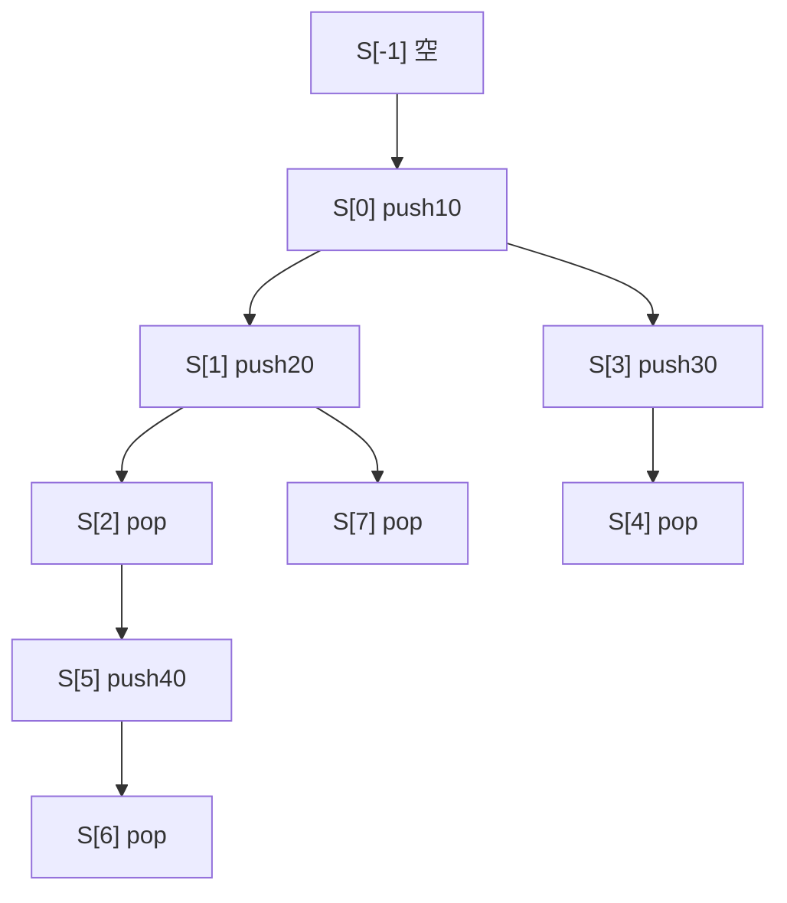

# Persistent Queue：共享历史、延迟反转与离线版本树

## 题意与完整分叉例子

初始版本 `S[-1]` 是空队列。第 i 次操作从一个旧版本 t 出发，产生 S[i]：
`0 t x` 在队尾追加 x；`1 t` 删除队首并输出被删的值。
`-1≤t<i`，所有出队操作保证旧队列非空，`Q≤500000`、`0≤x≤10^9`。
题面与参数见 [`task.md`](../../../upstream/data_structure/persistent_queue/task.md)、
[`info.toml`](../../../upstream/data_structure/persistent_queue/info.toml)。
旧版本不被改变，而且 push、pop 两种操作产生的版本都可以继续被引用。

```text
输入                 输出
8                    10
0 -1 10              10
0 0 20               20
1 1                  10
0 0 30
1 3
0 2 40
1 5
1 1
```

| 版本 | 来源与操作 | 新队列 | 输出 |
|---:|---|---|---:|
| 0 | 空队列 push 10 | `[10]` | |
| 1 | 版本 0 push 20 | `[10,20]` | |
| 2 | 版本 1 pop | `[20]` | 10 |
| 3 | 版本 0 push 30 | `[10,30]` | |
| 4 | 版本 3 pop | `[30]` | 10 |
| 5 | 版本 2 push 40 | `[20,40]` | |
| 6 | 版本 5 pop | `[40]` | 20 |
| 7 | 再从版本 1 pop | `[20]` | 10 |

最后一次还能从旧版本 1 删出 10，说明之前产生版本 2 的 pop 没有修改
版本 1。与持久并查集题不同，这里的 pop 版本也是一个真实可继承版本。

## 朴素复制和“两栈摊还”为什么需要重新审视

每次复制旧队列再改一下，最坏一次复制 O(Q) 个值，总时间/空间 O(Q²)。
持久化的基本想法是让未变部分共享，只为本次操作新建少量节点。
单链表在表头插入和删除都容易共享，但队列一端插入、另一端删除，不能
直接用一条朝同一方向的父链同时做到两端 O(1)。

普通队列常用两栈：F 从队首向后排，R 从队尾反向排，逻辑序列为
`F + reverse(R)`。push 只向 R 表头加节点；pop 从 F 表头取值；F 空时
把 R 反转到 F。只有一条操作历史时，每个元素至多反转一次，总计线性。

但持久化有分叉：若一个旧版本 F 空、R 很长，许多孩子版本都从这里 pop，
简单实作可能在每个分支重新反转同一段 R。一次普通历史的摊还账本不能
自动覆盖所有分支。必须共享已计算结果，或改变访问顺序、改用另一种表示。
上游选择共享的惰性构造，当前最快的几份则选择离线走版本树。

## 沿上游 `correct.cpp` 认识共享惰性队列

[`correct.cpp`](../../../upstream/data_structure/persistent_queue/sol/correct.cpp)
定义自己的 `persistent_queue<T>`，节点用 shared_ptr 管理。
它既不是每版 std::queue 的完整复制，也不是倍增树。一个版本保存：

| 字段 | 含义 |
|---|---|
| `f_st` | 逻辑前半部分的已生成链表开头，队首在这里 |
| `b_st` | 新近加入队尾的反向链表，push 只新建表头 |
| `stream` | 共享的生成状态，包含待扫描旧前链 `scan` 和待反转后链 `rotate` |
| `proc` | 前链构造的执行游标，不是队尾；普通操作推进一小步 |

节点的 next 可在需要时补齐。这种修改只把已经确定的逻辑尾部物化，
不会改变旧版本代表的元素顺序；各版本通过 shared_ptr 共享它。
proc 是原始指针，依赖所属前链/共享状态的所有权保持其生命周期。

### `stream_type::next()` 实际做两种不同的工作

若 scan 非空，复制 scan 的当前一个值成新节点，把 scan 向后推进，
返回这一个节点。若 scan 已空，就把 rotate 的**整条剩余链**逐个反转，
返回反转后的链表。这后一分支是 while，不是每次固定只反转一个元素。

通常 push/pop 看 proc：若 proc 非空且 `proc->next` 尚未生成，就调用
stream->next() 把结果缓存到这个 next；随后返回一个 proc 前进一步的新版本。
push 还在 b_st 前加新值，pop 则把 f_st 前进一步。若 proc 已空，表示
本轮生成已完成，需要启动新流，把当前前链作为 scan、当前后链作为 rotate。
push 与 pop 分别在创建流前加入新尾值或跳过旧队首。

### 连续三次 push，再从同一版分叉 pop

单独考虑依次加入 10、20、30 的过程：

1. push 10：scan 空，反转单个后节点，前链为 `[10]`，proc 指向 10。
2. push 20：推进 proc 到空，前链仍为 `[10]`，新后链为 `[20]`。
3. push 30：proc 已空，启动流 `scan=[10]、rotate=[30,20]`。
   构造器先复制一个 10 作为新前链头，后链字段重置，待生成尾部仍在 stream。
4. pop 这第三版：先输出 10，再推进生成。scan 已空，反转 rotate 得到
   `[20,30]`，缓存到新 10 的 next，返回前链 `[20,30]`。
5. 再从同一个第三版 pop：其 10 的 next 已有缓存，直接共享 `[20,30]`，
   不会再次消耗 stream 或重新反转。

这解释了为什么多个版本可以共享一个会推进的 stream：推进结果同时保存在
共享前节点的 next 中，其他分支先检查缓存，不能跳过这次检查再重复取流。

### 摊还界靠“先扫描、后整段反转”和共享缓存

实现没有显式存长度，但 proc 的推进隐含了平衡计数：开始新一轮流时，
若待扫描前链有 m 个元素，待反转后链有 m+1 个元素。
后面那次 O(m+1) 的整体反转之前，必须已经生成前面的 m 个扫描节点，
每次普通 push/pop 至多推进一个这样的生成步骤。故反转成本可以记到
此前这些步骤上；m=0 时只反转一个节点。

同一流的已生成 next 被分支共享，不会为每个分支重付相同扫描/反转。
按这些节点创建与生成次数计，整批版本操作为摊还 O(Q) 时间、O(Q) 节点
存储，但**某一次**操作仍可能触发长 while，不能称最坏 O(1) 的实时队列。
shared_ptr 分配、引用计数、节点复制和缓存缺失也都是真实常数成本。
main 保存 Q+1 个版本句柄，边读边输出，属于在线接口。

## 利用全部输入已知：把持久化变成版本树遍历

每个操作只有一个旧版本 t，将 t→i 连边，所有版本构成一棵树：



先读完输入，再 DFS 版本树，只维护一个普通数组队列 `[front,back)`：

```text
进入 push(x)：buffer[back++]=x
进入 pop：answer[id]=buffer[front++]
访问这个新版本的所有孩子
退出 push：--back
退出 pop：buffer[--front]=answer[id]
```

沿根到当前版本的路径，恰好是它继承的全部操作；进入新点时当前队列正是
父版本，应用一次 push/pop 后得到新版本。退出时把游标和源码记录的值
恢复，兄弟版本就能从同一个父状态出发，不需要拷贝。

例子先走版本 1：buffer 的有效部分是 `[10,20]`，front=0、back=2。
进入版本 2 后 front=1，答案为 10；再进入版本 5，写 buffer[2]=40，
back=3，队列为 `[20,40]`。进入版本 6 后输出 20，随后逐层撤销：
退回版本 5 的 front=1，再退回版本 2 的 back=2，最终退回版本 1 的
front=0、back=2。此时进入版本 7，仍可删出 10。

每条版本边进入/退出各一次，每次只读写固定数量的数组槽，因此总时间
O(Q)、空间 O(Q)。省去上游每个版本的共享链表、流对象与引用计数，
代价是离线保存操作/版本边/答案，并且不能处理依赖上一答案才给出的新输入。
答案按输入中的 pop 序号存放，DFS 可以用任意孩子顺序。

## 当前前五与范围

以下来自 [`global.json`](global.json) 的 **2026-09-26 05:10:19 UTC**
不同用户前五，均为当时最新测试版本 AC，语言均为 `cpp`。
源码与哈希见 [`config.json`](../../selected/persistent_queue/config.json)。
本题无归档 `candidate_pool.json`，本文只审阅这五份，不声称已找到
所有在线/离线家族的全站最快。最新状态与本轮实际重测分开记录。

| 名次 | 提交 / 用户 | 时间 | 实际路线 |
|---:|---|---:|---|
| 1 | [#404575](https://judge.yosupo.jp/submission/404575) / Rohan_Kapri，[源码](../../selected/persistent_queue/404575.cpp) | 24 ms | OfflinePersistentQueue，数组版本边与递归回滚 |
| 2 | [#393911](https://judge.yosupo.jp/submission/393911) / chaihf，[源码](../../selected/persistent_queue/393911.cpp) | 29 ms | 同一 OfflinePersistentQueue 内核 |
| 3 | [#211296](https://judge.yosupo.jp/submission/211296) / oldyan，[源码](../../selected/persistent_queue/211296.cpp) | 35 ms | LinkBucket 版本树，单数组队列回滚 |
| 4 | [#272644](https://judge.yosupo.jp/submission/272644) / Richard1211，[源码](../../selected/persistent_queue/272644.cpp) | 43 ms | 同类桶树与回滚，另一套模板读写 |
| 5 | [#231826](https://judge.yosupo.jp/submission/231826) / tonegawa，[源码](../../selected/persistent_queue/231826.cpp) | 50 ms | 在线尾父链、惰性整段快照；分叉重建成本须单独看 |

### #404575 / #393911：同一内核，别被同文件的其他持久化类误导

两份 main 都只实例化 `toy::OfflinePersistentQueue<u32>`，该类文本相同。
first_child[version] 保存孩子链头，每条 Operation 内有 next、answer、value。
push 的 answer=-1，pop 存其输出序号；插入孩子时把新节点放在链头，
所以 DFS 往往逆输入次序访问兄弟，答案序号恢复正确输出顺序。

visit 的执行、递归、撤销正是前面的四个数组动作。初始版本映射到 0，
输入 t 统一加一；solve 从初始版本的各孩子开始，不在根伪做一个 pop。
buffer 与 answers 一次按操作/答案数分配，push_back 操作记录提前 reserve。
文件里还有 RollbackUnionFind、倍增 PersistentQueue、持久数组与仿射结构，
都未被这个 main 调用，不能据模板存在说它用了持久化线段树。

两份数学内核相同，I/O 均为 direct_mapping、字段长度特化和缓冲数字输出。
缓存稿的头部组织不同，24/29 ms 不代表两种队列算法。
递归版本链最深可到 Q，仍依赖足够大的进程栈；显式进入/退出事件可保留
同一算法并移除这项实现条件。

### #211296：两个队列游标和一个桶容器

`solve_rollbackdsu` 这个名字容易误导，它没有使用并查集，真正状态只有
buf、l、r 和答案 res。输入把每个版本的新操作挂到 `LinkBucket<Node>`，
Node 存新版本号、是否队尾插入以及值/答案序号。
根用 at_back=false、x=无符号 -1 表示“不执行操作”；源码用 `~x`
区分根哨兵与真实 pop 序号。pop 保证非空，不需分支处理非法出队。

DFS 后撤销 push 的 r 或 pop 的 l，并按保存答案写回槽位，复杂度 O(Q)。
它使用固定容量 500000 的队列数组，版本桶与答案则按实际规模分配。
cin/cout 被宏替换为 OY::LinuxIO，Unix 下映射读取，输出查表并缓冲。

### #272644：同样的回滚，不是模板里的 priority_queue

`main→SolveMain` 读入操作后构造 `OY::LBC::Container<Node>`，
一基版本编号，buf 为固定数组，Head/Tail 模拟当前队列。
递归 lambda 先执行操作，遍历孩子，再用与 #211296 相同的逆操作恢复。
复杂模板中普通 queue、priority_queue、各种 pop 辅助函数没有成为主路径。

区别主要是桶容器版本、宏封装和 `fread` 缓冲整数读取等工程细节；
主操作 O(Q)、空间 O(Q)、递归深度限制相同，不能给它另起一个算法族。

## #231826：在线尾链与按需构造的快照

每个 push 建一个不可变节点，par 指向旧队尾，val 保存新值；每个版本
保存 last、len 和 lenL。last 反向串起该版本的全部插入历史，逻辑队列
是其中最后 len 个尚未删除的节点。lenL 表示当前快照还覆盖多少个队首元素，
之后的新 push 是尚未进入快照的后半部分。

R 对象保存某次需要重整的版本 u 和一个 vector。`front(v)` 若发现
共享的 vector 为空，才从 last[u] 沿 par 取 lenL[u] 个节点，按“新到旧”
放进 vector；队首就是 `vector[lenL[v]-1]` 对应的值。
同一 R 的后续查询共享已构造数组，pop 只把 len、lenL 各减一，push
则 len 加一、lenL 暂不变。

`check` 在 `len==2*lenL+1` 时创建一个新 R，并把 lenL 改成 len，
等价于后半部分比前半部分多一个时重整。否则继承旧 R 指针。
它的好处是不会在每次 pop 上用倍增爬尾父链，也不在创建快照时立即复制
所有元素，没被查询的 R 可以一直不物化。

### 这个整段物化不具备上游同样的分支摊还保证

取一个版本有 6 个元素、lenL=3。从它分出两个不同 push，各新版本都满足
len=7=2*3+1，因此各自 new 一个不同的 R。立刻分别 pop 两个新版本，
就会各自遍历并分配 7 项；前六项虽然来自同一旧版本，也没有共享新 R 的
物化工作。构造这样的基版本只需连续 push：快照覆盖长度按 1、3、7…增长。

推广为旧版本 len=2m、lenL=m（m 可取 `2^h-1`），从这里产生许多
“push 一个新值、再 pop”的兄弟分支。每分支仅两次操作，却各自物化
2m+1 项。按这份源码，最坏总构造时间和已物化 vector 空间可达 O(Q²)，
不能照搬普通两栈或上游共享渐进生成的 O(Q) 摊还结论。
这是由具体控制流得到的复杂度边界，本篇未进行 OJ 攻击或超时实验。

输入一次读进 32 MiB 缓冲，输出使用 16 MiB 缓冲，fast_io 对象在 main
栈上，另有每版固定数组与动态 R/vector。单次 front 最坏线性，push/pop
本身的元数据修改为 O(1)。当前 50 ms 只说明它在快照测试中的表现，
不证明任意分叉分布都保持相同效率。

## 一个更直接的在线对照：尾父链加倍增

本地 [`binary_lifting.cpp`](../../../problems/data_structure/persistent_queue/binary_lifting.cpp)
也从不可变尾父链出发，但不做整段快照。每个 push 节点保存
1、2、4、8…级祖先，一个版本只需 `(back,size)`；队首就是 back 的
第 size-1 级祖先。pop 找出它并输出，保留 back、把 size 减一。

例如 `[10,20,30]` 的尾链为 `30→20→10`，size=3，队首向上两步为 10。
pop 后 `(back=30,size=2)` 表示 `[20,30]`，旧 size=3 的版本还在。
push 新值建一个新尾节点，父亲连旧 back，旧节点完全不改。
每次 O(log Q)、空间 O(Q log Q)，但有直接的单次界且可在线访问任意旧版本。

本地 [`rollback_version_tree.cpp`](../../../problems/data_structure/persistent_queue/rollback_version_tree.cpp)
保留离线路线，说明见 [`tutorial.md`](../../../problems/data_structure/persistent_queue/tutorial.md)。
核验可小规模复制 deque 作参照，覆盖空版本 push、单元素 pop、同一旧版
多次分叉、pop 版本再 push、深版本链、相同值、0 和最大值。
性能分布还必须包含反复从平衡边界分叉的版本树，不能只测试单一线性历史。
本文只读本地源码与算例，没有新的 OJ 请求或性能 benchmark；本地历史
cycles 比值不当作本轮 24…50 ms 的控制变量比较。
