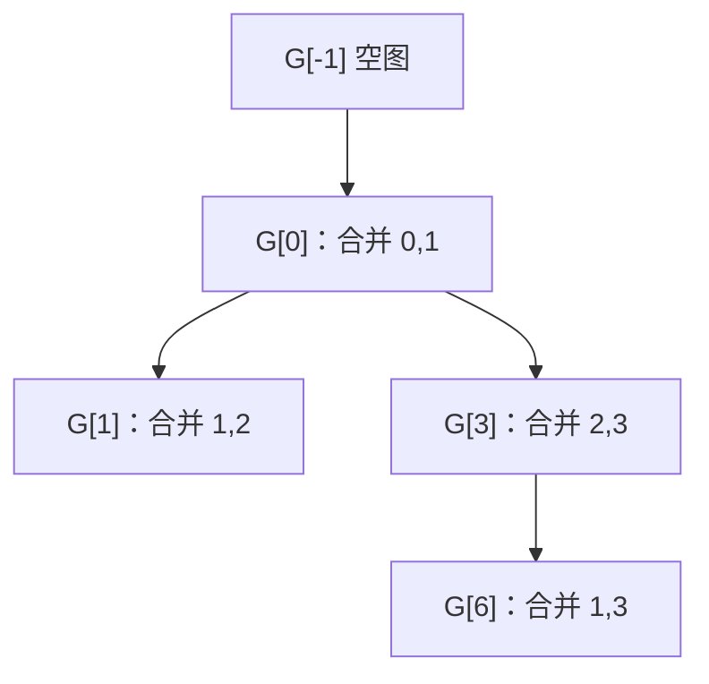

# Persistent Unionfind：沿版本树应用合并，再撤销回来

## 题意：新版本可以从任意旧合并版本分叉

`G[-1]` 是 N 个点、没有边的初始图。第 i 次操作：

- `0 k u v`：在旧图 G[k] 中加入边 u–v，形成新图 G[i]。
- `1 k u v`：询问 G[k] 中 u、v 是否连通，输出 0 或 1。

`N,Q≤200000`，`-1≤k<i`，而且 k 只能是 -1 或之前**合并操作**的编号。
查询操作本身不建立可被后续引用的图版本。详见
[`task.md`](../../../upstream/data_structure/persistent_unionfind/task.md)、
[`info.toml`](../../../upstream/data_structure/persistent_unionfind/info.toml)。
不能把它理解成“撤销到最近一次历史”；多个兄弟版本可以同时被后续操作引用。

```text
输入                 输出
4 8                  1
0 -1 0 1             0
0 0 1 2              0
1 1 0 2              1
0 0 2 3
1 3 0 2
1 0 0 2
0 3 1 3
1 6 0 3
```

| 合并版本 | 来源 | 连通分组 |
|---|---|---|
| G[-1] | 初始 | `{0},{1},{2},{3}` |
| G[0] | G[-1] 加 0–1 | `{0,1},{2},{3}` |
| G[1] | G[0] 加 1–2 | `{0,1,2},{3}` |
| G[3] | G[0] 加 2–3 | `{0,1},{2,3}` |
| G[6] | G[3] 加 1–3 | `{0,1,2,3}` |

G[1] 与 G[3] 都从 G[0] 出发：在 G[1] 里 0 与 2 连通，不意味着 G[3]
或旧 G[0] 也连通。因此四次查询依次为 1、0、0、1。

## 朴素复制，以及为什么普通路径压缩不能原样套用

最直观的方法给每个新版本复制完整 parent/size 数组，再做普通合并。
每次复制 O(N)，最多 O(NQ) 时间和空间；二十万平方个父槽无法接受。
另一做法是每次查询重新走根版本到目标版本的所有合并，长版本链同样会
产生 O(Q²) 次重复工作。

并查集本身只改变很少的根项。根用负大小、非根用父编号时，按大小连接
两个不同集合只改两个位置。保留这两个旧值，之后就能恢复原来的状态。
普通分组与按大小的证明见 [`Unionfind`](../unionfind/analysis.md)。

回滚版一般关闭路径压缩，因为查找也会改父指针。例子中原来有
`1→0`、`3→2`，临时把根 2 接到 0 后，查询 3 若压缩成 `3→0`，
退出版本时只恢复 `2→2`，3 仍错误地留在 0 组。除非把查询造成的所有
改写也记入历史，否则不能这样压缩。只按大小时树高 O(log N)，
find 不写数组，成功合并只需保存两个槽，是最简单的可撤销不变量。

## 把版本关系排成树，就可以只维护一份当前状态

每个合并版本只有一个旧版本来源，将 k→i 连边就得到版本树：



查询挂在它所引用的版本上。先读完所有操作，就能按 DFS 顺序访问这棵树：
进入子版本时执行它新增的合并，回答挂在这里的查询；走完其所有后代后，
撤销本次合并，再去另一个兄弟。

```text
visit(version):
    checkpoint=历史栈长度
    若不是空版本: merge(该版本新增的边)
    回答挂在该版本的查询
    for child in 子版本: visit(child)
    回滚到 checkpoint
```

不变量是：进入一个版本后，当前 DSU 恰好包含版本树根到此点路径上的
合并，既不漏祖先，也不包含已经离开的兄弟。离开前恢复 checkpoint，
就重新得到父版本。答案带输入序号，最后按原查询顺序输出，DFS 次序不会
改变用户看到的答案次序。这叫离线解法，因为需要先知道完整版本树。

## 手走回滚：父亲和大小都要恢复

选择相同大小时保留较小根，一基/零基无关，示例用负大小数组：

| DFS 时刻 | parent_or_size | 历史要恢复的改动 |
|---|---|---|
| 空图 | `[-1,-1,-1,-1]` | 无 |
| 进入 G[0] | `[-2,0,-1,-1]` | 原槽 0=-1、1=-1 |
| 进入 G[1] | `[-3,0,0,-1]` | 原槽 0=-2、2=-1 |
| 离开 G[1] | `[-2,0,-1,-1]` | 弹出 G[1] 的记录 |
| 进入 G[3] | `[-2,0,-2,2]` | 原槽 2=-1、3=-1 |
| 进入 G[6] | `[-4,0,0,2]` | 原槽 0=-2、2=-2 |
| 离开 G[6] | `[-2,0,-2,2]` | 两槽都恢复 |

同组的重复合并不改变分组，也不改变大小。实现有两种合法记账方式：
每次 merge 都压一个记录，同组合并用空记录；或者仅成功合并记历史，
并且只在成功时 undo，或回滚到栈长度。不能混用“失败不记录”与“每次都 undo”，
否则会误撤销更早的一条有效合并。

正确按大小且完整回滚时，每条版本边进入/退出各一次，
总时间 `O((N+Q)log N)`，更精确地说初始化 O(N)、操作 `O(Q log N)`；
空间 O(N+Q)，不为每个版本复制 N 个元素。版本 DFS 的深度却可能达到 Q，
这与 DSU 父链高度 O(log N) 是两种不同的深度，必须分别考虑。

## 上游 `correct.cpp` 的实际主路径与缺失的大小恢复

上游 [`correct.cpp`](../../../upstream/data_structure/persistent_unionfind/sol/correct.cpp)
把操作编号整体加一，使初始版本 -1 对应内部节点 0。
`queries[k+1]` 收集依赖该版本的操作；查询也存成叶节点，因为题目禁止
后续版本引用查询。递归 dfs 进入 t=0 节点就 unite，离开就 rollback，
t=1 只调用 same 并记录答案。

`RollBackUnionFind` 使用 node、size_vec 两数组，find 不压缩。
unite 在任何情况下都把两根的旧父亲压入 info；同根也有记录，因此与
离开时每次 rollback 配对。内部虚拟根 t[0]、u[0]、v[0] 默认为 0，
还会执行一次 0 与自身的空合并，再在最终撤销。

但必须按代码指出：**rollback 只恢复 node，没有恢复 size_vec**。
例如将两个单点合并后 size_vec[新根] 变成 2，退出该版本后它仍是 2，
虽然集合已经回到一个点。兄弟分支继续累加，会使 size_vec 脱离真实集合大小。
在整数运算未溢出时，父指针恢复仍足以保持连通分组，选择哪根为父不影响
连通答案；可是“每次浅树接深树/小组接大组”的标准高度证明已不适用。

因此不能把上节 `O(Q log N)` 界直接归到**这份未恢复大小的文件**。
保守地说 find 可能沿 O(N) 父链，大小累计也应检查整数范围。
要得到标准回滚复杂度，应同时恢复父指针和大小；下面当前代表正是这样做的。
上游用 `vector<vector<int>>` 存版本边，scanf/printf 读写，递归深度
最坏 Q。本篇讨论的是实际源码行为，不把典型正确回滚模板替换成上游原稿。

## 当前前五：都是离线回滚，只有三种独立实现

以下为 [`global.json`](global.json) 的 **2026-09-26 05:10:21 UTC**
不同用户前五，均为当时最新版本 AC；源码和哈希见
[`config.json`](../../selected/persistent_unionfind/config.json)。
没有归档 `candidate_pool.json`，本文没有搜索更深名次里的在线持久化代表。
状态为最新不等同于本文主动重测。

| 名次 | 提交 / 用户 | 语言 | 时间 | 实际路线 |
|---:|---|---|---:|---|
| 1 | [#404578](https://judge.yosupo.jp/submission/404578) / Rohan_Kapri，[源码](../../selected/persistent_unionfind/404578.cpp) | cpp | 18 ms | 连续版本桶、负大小回滚、递归 DFS |
| 2 | [#218108](https://judge.yosupo.jp/submission/218108) / sortA0329，[源码](../../selected/persistent_unionfind/218108.cpp) | cpp | 18 ms | 与第一份源码字节相同 |
| 3 | [#211293](https://judge.yosupo.jp/submission/211293) / oldyan，[源码](../../selected/persistent_unionfind/211293.cpp) | cpp | 19 ms | 压缩合并版本编号、链式桶、DFS 帧直接记两根 |
| 4 | [#211292](https://judge.yosupo.jp/submission/211292) / Anonymous，[源码](../../selected/persistent_unionfind/211292.cpp) | cpp | 19 ms | 与第三份源码字节相同 |
| 5 | [#405488](https://judge.yosupo.jp/submission/405488) / toomer，[源码](../../selected/persistent_unionfind/405488.rs) | rust | 20 ms | CSR 版本边、显式进入/退出栈、仅成功合并记撤销 |

### #404578 / #218108：每次 merge 精确保存两根旧槽

main 只调用 `OfflinePersistentUnionfindQuery`，并未使用文件里普通
路径压缩 UnionFind。内部 `RollbackUnionFind::root` 是不改数组的 while，
parent 根槽存负大小。历史记录包含两根下标、各自旧 parent_or_size、
以及是否真合并；undo 原样恢复两个槽，连同组数也按标志恢复。
同组合并照样压入空记录，所以每个版本固定一次 merge、一次 undo。

版本边先计数、求前缀和，再填到一段连续 gr 数组，各版本的孩子位于
`[cnt[k],cnt[k+1])`。这比上游给每个版本一个 vector 少了很多小容器，
相邻孩子访问也连续。虚拟初始版本用额外点 n 的自合并表示，DSU 因此开
n+1 个点，不改变实际点的连通关系。

查询结果先存 0/1 加一，0 保留为“不是查询”，最后再压紧为 bool 数组。
压紧循环写成对每个 i 都访问 `res2[s]` 的表达式；无查询或最后一条查询
之后还有合并时，应显式用 if 跳过非查询，避免构造越界槽访问。
这属于源码边界审阅，本篇未把它包装成已执行的 OJ 反例。
主要算法在完整回滚下为 O(Q log N)、O(N+Q)，版本 DFS 仍递归。
I/O 由 GSH Reader/Writer 处理，源码只有定义 EVAL 时选择 MmapReader，
不能仅见文件里存在映射类就认定所有构建都走映射。

### #211293 / #211292：不用容器历史栈，依赖递归帧的两个根

输入时只给 t=0 的合并版本分配连续的新 ID，查询直接挂到它引用的版本，
并保存独立的答案序号。`LinkBucket<Node>` 用头数组与节点 next 字段构成
连续存储的链式桶。版本节点从 Q 个缩到合并数，查询没有自己的递归帧。

进入一帧先求 head_a、head_b；若不同，按真实大小选择方向，然后调用
`unite_to<false>`。这个 false 明确关闭类自身的 m_records 记录，
因为两根下标已经保存在当前递归帧。走完所有子版本后调用
`cancle(head_a,head_b)`：把小根恢复自指，并从大根大小减去小根大小。
嵌套修改都已经先撤销，小根的旧大小仍可用，所以无需再保存一整份数组。
同根时既不合并也不撤销，与它的记账方式匹配。

相对上游，它恢复了大小、压缩了版本编号、减少独立历史记录；
仍是 O(Q log N) 时间、O(N+Q) 空间。函数名 cancle 的拼写和
solve_rollbackdsu 都只是源码名字，不表示另外一种持久化机制。
cin/cout 宏实际指向 OY::LinuxIO 的映射/缓冲读写。

### #405488：显式退出事件替代版本递归

Rust 先把所有操作读入数组，用 `DirectedSparseGraph::from_edges`
构造版本 CSR。栈元素是 `(操作下标,是否退出)`：进入合并时先执行 unite，
成功就压一个退出事件，再把所有孩子的进入事件压上去。
后进先出保证孩子全部处理后才遇到退出事件，执行 undo，正好模拟递归回程。
合并失败不会改状态，既不记录历史，也不压退出事件。

类型别名 `UndoableUnionFind` 指定 UnionBySize、**无路径压缩**及 Undoable。
历史保存两根的完整 cell 克隆，包含父/大小信息，undo 原样写回。
same 不会悄悄改变路径，所以两项记录足以恢复。查询结果按原操作编号保存，
最终扫描输入操作只输出 t=1 项。

这份把版本树的 O(Q) 深度放到堆上的 Vec 中，避免进程递归栈限制；
没有因此改变 O(Q log N) 复杂度，也没有把它变成每次输入后立刻可答的
在线持久结构。缓冲解析与输出由 Rust 库宏调度，普通势并查集等模板未使用。

## 如果必须在线：持久化数组的路径复制

离线回滚只在 DFS 当前分支保存一份状态。若每次操作到达后必须立刻回答，
可以让每个版本保留自己的不可变数组根，把 parent_or_size 存进持久化
线段树。线段树是数组的二分索引，改一个槽只复制从根到叶的 O(log N)
个节点，未改的子树与旧版本共享。

例子 G[0] 的数组 `[-2,0,-1,-1]` 变成 G[1] 的 `[-3,0,0,-1]`，
只需更改槽 0、2；槽 1、3 的存储仍与旧版本共享，旧根仍能访问旧值。
一个版本只保存一个线段树根指针/下标，不是复制 N 个槽。

不压缩、按大小使 DSU 父链 O(log N)，但沿链每读取一个父槽又需
O(log N) 的持久数组查询，所以 find、合并和连通查询为 O(log²N)。
一次成功合并新增 O(log N) 个树节点，总空间 O(N+Q log N)，初始全为
-1 时还可以用隐式空节点节省初始构造。它提供在线随机版本访问，付出的
代价是更多索引层与节点分配；当前前五并未走这条路径。

本地 [`rollback_version_tree.cpp`](../../../problems/data_structure/persistent_unionfind/rollback_version_tree.cpp)
与 [`persistent_segment_tree.cpp`](../../../problems/data_structure/persistent_unionfind/persistent_segment_tree.cpp)
分别保留两种方案，说明见 [`tutorial.md`](../../../problems/data_structure/persistent_unionfind/tutorial.md)。
验证应覆盖兄弟分支、深版本链、无查询、全查询、重复合并、u=v、查询初始
空版本；小规模直接复制数组可作独立参照。性能比较还应拆分版本边布局、
回滚记录、递归/显式栈和 I/O。本文只核对源码与例子，不把本地 tutorial
的历史 benchmark 当作当前 18/19/20 ms 之间的控制实验。
