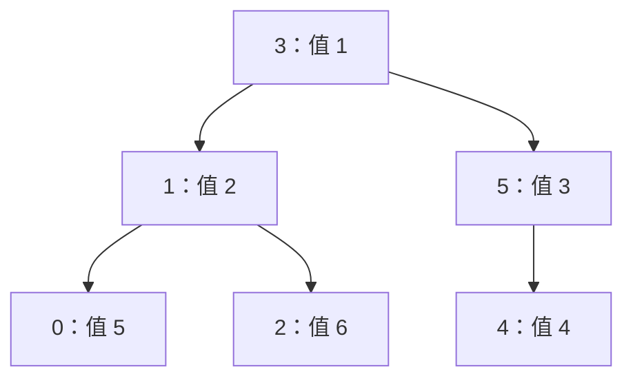

# Cartesian Tree：从递归找最小值到一次单调扫描

## 题意：顶点是下标，优先级是数组值

输入互不相同的整数数组 `A[0..N-1]`，构造它的最小笛卡尔树。
这棵二叉树同时满足：中序遍历的顶点编号为 `0,1,…,N-1`；
父亲的数组值小于孩子的数组值。中序遍历是“左子树、当前点、右子树”。
因此全局最小值必为根，根左边的下标属于左子树，右边的下标属于右子树，
递归应用这个定义就唯一确定了整棵树。

题目只要求输出每点的父亲 `p[i]`；根 r 输出 `p[r]=r`，不是 -1。
约束为 `1≤N≤1000000`、`0≤A[i]≤10^9`，值互异，见
[`task.md`](../../../upstream/tree/cartesian_tree/task.md)、
[`info.toml`](../../../upstream/tree/cartesian_tree/info.toml)。

```text
输入
6
5 2 6 1 4 3

输出
1 3 1 3 5 3
```

全局最小值 1 在下标 3，所以根为 3。左段 `[5,2,6]` 以顶点 1 为根，
其左右孩子为 0、2；右段 `[4,3]` 以顶点 5 为根，左孩子是 4：



沿中序读回 `0,1,2,3,4,5`，每条父边的值都递增，逐项得到上面的父数组。
编号小不等于值小；父亲编号既可能小于孩子，也可能大于孩子。

## 最直观的递归为什么会退化

直接按照定义，对每个区间扫描最小值位置 m，再递归左右区间：

```text
build(l,r,parent):
    if l==r: return
    m = [l,r) 中最小值的下标
    p[m] = parent（根则用 m 自己）
    build(l,m,m)
    build(m+1,r,m)
```

正确性就是定义本身。但递增数组的最小值每次都在左端，区间长度依次为
N、N-1、…、1，总扫描量 `N(N+1)/2=O(N²)`。百万项时约五千亿次比较，
递归深度也会达到 N。即使先建区间最小值索引，也要额外建表。
这一题更好的办法，是在加入每个新元素时复用前缀已经建好的树。

## 新元素只能修改树的最右侧路径

已经处理 `[0,i)` 后，新顶点 i 的编号最大，必须成为中序最后一个顶点。
因此它只能接在旧树的“根不断沿右孩子向下”的路径上。路径中的值从上到下
严格递增，这是最小堆序的要求。

从路径最末端往上看：比 `A[i]` 大的点不能做 i 的父亲，必须转到 i
下方；遇到第一个更小的点，i 就接在它的右侧。被移走的整段路径连同其
左子树，整体成为 i 的左子树。**只需让最后移出的那个点改认 i 为父亲**，
更早移出的点已经挂在它下面，原来的关系应保留。

这条右侧路径可以用按值递增的下标栈保存：

```text
last=-1
while 栈非空且 A[栈顶]>A[i]:
    last=弹出栈顶
if 栈非空: p[i]=栈顶
else: p[i]=-1
if last!=-1: p[last]=i
压入 i
```

栈的不变量有两部分：从底到顶既是当前树的右侧路径，也是值严格递增的
下标序列。新点下标最大保证中序不变；移走较大值、接到较小值下方保证堆序。
没有被弹出的旧子树完全不用重建。

| 加入下标 / 值 | 弹出顺序 | 最后弹出点 | 加入后的栈 | 最终需要改的父边 |
|---|---|---|---|---|
| `0 / 5` | 无 | 无 | `[0]` | 0 暂为根 |
| `1 / 2` | 0 | 0 | `[1]` | `p[0]=1`，1 暂为根 |
| `2 / 6` | 无 | 无 | `[1,2]` | `p[2]=1` |
| `3 / 1` | 2、1 | 1 | `[3]` | `p[1]=3`；`p[2]=1` 保留 |
| `4 / 4` | 无 | 无 | `[3,4]` | `p[4]=3` |
| `5 / 3` | 4 | 4 | `[3,5]` | `p[4]=5、p[5]=3` |

最后栈底 3 是全局根，置 `p[3]=3`。虽然出现 while，每个点只入栈一次、
出栈一次，总弹出次数至多 N，所以构造 `O(N)` 时间、`O(N)` 空间。
递增数组只压栈，递减数组每次弹一个旧根，两种极端都仍是线性时间。

## 上游 `correct.cpp` 用父链充当隐式栈

上游 [`correct.cpp`](../../../upstream/tree/cartesian_tree/sol/correct.cpp)
没有单独的 `stack` 数组。`construct_cartesian_tree` 从 i=1 开始，
令 `p=i-1`，沿 `parent[p]` 上爬。上一点 i-1 正在旧树最右端，因此
这条祖先链正是刚才的右侧路径；扫描到较小值或 -1 就停止。
它和显式单调栈具有相同的线性摊还复杂度，不能把上游误认成朴素 `O(N²)`。

但它在爬链时会临时更改父边。变量 l 记上一次经过的点，pp 暂存 p 的
旧父亲，避免修改父边后丢失向上的路径。每步先把上一次的临时连接恢复为
`parent[l]=p`，再临时设 `parent[p]=i`，然后继续去 pp。
这样最后留下的仅是最上方被移走子树的根连接到 i。

手走 i=3、值为 1 的步骤：旧父边为 `2→1`，从 p=2 出发；
先暂设 `parent[2]=3`，继续到旧父亲 1；下一步把 `parent[2]` 恢复成 1，
再设 `parent[1]=3`。最终 `parent[3]=-1`，旧边 `2→1` 保留。
这说明源码中 `if(l!=-1) parent[l]=p` 不是多余逻辑：删掉它会把整段
右侧路径错误地变成 i 的多个直接孩子。

`main` 先存全部 A，调用构造器，再把 -1 根转换为自身编号输出。
原数组与父数组各 N 个 int，核心约 `8N` 字节；构造没有递归栈。
精选快解已经不能再改善 `O(N)` 阶，主要改变的是父链访问、写入次数、
输入布局和输出开销，而不是又一次把平方算法改成线性。

## 当前五份提交和范围

以下来自 [`global.json`](global.json) 的 **2026-09-26 05:09:18 UTC**
不同用户前五快照，均为当时 `is_latest=true` 的 AC。缓存源码、哈希和
评测语言见 [`config.json`](../../selected/cartesian_tree/config.json)。
本题没有归档的 `candidate_pool.json`，本文只审阅这五份主路径，不能
把它们当成完整算法族搜索结果；最新状态也不代表本轮主动重测了每份。

| 名次 | 提交 / 用户 | 语言 | 时间 | 实际构造 |
|---:|---|---|---:|---|
| 1 | [#215554](https://judge.yosupo.jp/submission/215554) / oldyan，[源码](../../selected/cartesian_tree/215554.cpp) | cpp | 21 ms | 带哨兵、回调输出孩子关系的值栈，边读边构造 |
| 2 | [#405124](https://judge.yosupo.jp/submission/405124) / Rohan_Kapri，[源码](../../selected/cartesian_tree/405124.cpp) | cpp20 | 22 ms | 同一 OY 构造路径 |
| 3 | [#244237](https://judge.yosupo.jp/submission/244237) / cmk666，[源码](../../selected/cartesian_tree/244237.cpp) | cpp | 28 ms | 显式下标栈，先存左右孩子再转父数组 |
| 4 | [#87515](https://judge.yosupo.jp/submission/87515) / nor，[源码](../../selected/cartesian_tree/87515.cpp) | cpp | 29 ms | 固定数组栈，直接改最后弹出点的父亲 |
| 5 | [#258373](https://judge.yosupo.jp/submission/258373) / Taiki0715，[源码](../../selected/cartesian_tree/258373.cpp) | cpp | 31 ms | 预分配 vector 栈，返回父数组 |

### #215554 / #405124：右孩子定型后才回调

两份 `main` 都调用 `OY::Cartesian::solve<uint32_t>`，传入读取一个值的
mapping、左右孩子回调、`std::greater<uint32_t>()` 和哨兵值 0。
这里 comparator 的实参顺序是 `comp(栈顶值,新值)`，greater 表示
“栈顶更大就弹出”，所以实际构造最小树。不能看到 greater 就标成最大树。

栈槽保存 `(index,right_child,value)`。一个点还在右侧路径上时，它的右孩子
可能被后续更小元素替换，因此先把最新右孩子留在槽里；点弹出时，它以后
不会再处于右侧边界，其右孩子已经定型，才调用右孩子回调填 `fa[child]`。
新点的左孩子是最后弹出的根，可以立即回调。扫描结束再逐个弹出剩余栈，
补齐尚未定型的右孩子关系。这避免上游对每个经过节点临时改父亲再恢复。

栈底有一个值为 0 的哨兵。题目值非负且比较严格，所以 `0>新值` 永远
不成立，循环无需在每次比较前检查栈是否空。即使输入包含 0，哨兵也不会
弹出。这个技巧依赖值域和比较方向，不能用于任意带负值输入而原样保留。
无孩子用无符号 -1，回调里的 `if(~child)` 排除这个哨兵下标。

实际模板默认是 `VectorBuffer`，用 `new node[N+1]`，并未实例化文件中的
`StaticBufferWrap`。输入值直接进入栈，不保留单独 A 数组；但每槽有三个
32 位字段，加上父数组，最坏约 `16N` 字节，不能因此声称一定比上游少用
总内存。收益是连续栈访问、减少父数组临时写入和读取时即构造。
`cin/cout` 被宏替换成 `OY::LinuxIO` 的映射输入及缓冲输出。

### #244237：先记录二叉结构，再一次生成父亲

`cartesian_tree` 用一基下标。k 从当前栈顶位置向下找第一个更小值，
`rc[stk[k]]=i` 设置新右孩子；若弹过点，`lc[i]=stk[k+1]` 设置被移走
子树的根，然后重设栈顶。并没有对每个弹出点写父亲。
构造完再扫所有点，令左右孩子的父亲为当前点，最后输出时编号减一。

不存在的孩子为 0，批量回填会写 `fa[0]`，但这个占位槽不输出。
真正根先设为自己的父亲，不会被其他真实孩子关系覆盖。a、左右孩子、父亲、
栈共五条线性 int 数组，约 `20N` 字节；比直接父数组版多一次扫描和两个
孩子数组，换来可以直接复用二叉树形状。文件中的 Montgomery 模板没有
在 `main` 调用。输入输出为自定义 FastIO，正常 Unix 路径支持映射输入。

### #87515：最接近教学伪代码的固定数组版

先把所有值读入固定容量 `a`，用 `stk/pos` 保存右侧路径。弹栈只更新
`last_popped`，结束后最多两次父边赋值；栈空时让当前点暂时指向自身，
以后若遇到更小值，它仍可被改接到新根下方。最终只有全局根自指。
它在遇到值小于新值时停止，否则弹出；输入互异，和严格大于弹栈等价。

a、parent、stk 三数组核心约 `12N` 字节，时间仍 `O(N)`，没有任何
CPU 向量指令的算法要求。源码把 `cin/cout` 替换成自定义 `IO`，不能
将入口里的 `sync_with_stdio(false)` 误读为仅靠标准流完成 I/O。

### #258373：vector 预留完整容量，父数组返回

实际调用 `cartesian_tree<T,MIN=true>`。`fast_stack` 内部一次分配 N 个
元素，push/pop 只调整整数指针，不会逐次扩容。保留最后弹出的 ls，
设置 `res[ls]=i`，非空栈顶作为 i 的父亲，和教学过程一致。
返回的根仍为 -1，由 `main` 输出阶段改为自身。`a=cartesian_tree(a)`
在完成构造后才覆盖原 a，不会在比较过程中丢失原数值。

构造峰值含输入、结果和栈三个线性数组。I/O 是基于 `fread/fwrite` 的
缓冲读写；它有最大树备用模板分支，但本题实例化 MIN=true，不应把
未运行分支纳入算法解释。31 ms 反映具体封装与 I/O 的总成本，不能用
一次榜单次序证明 vector 本身必然慢于固定数组。

## 如何验证与选择

本仓库已有
[`fixed_monotonic_stack.cpp`](../../../problems/tree/cartesian_tree/fixed_monotonic_stack.cpp)
与 [`vector_monotonic_stack.cpp`](../../../problems/tree/cartesian_tree/vector_monotonic_stack.cpp)，
说明见 [`tutorial.md`](../../../problems/tree/cartesian_tree/tutorial.md)。
它们与上述显式栈同族，上游父链也是同一个边界不变量的另一种存法。

正确性检查可以同时验证：恰有一个自指根；所有其他父边值严格变小；
按二叉孩子恢复的中序仍为 `0..N-1`。小规模再和递归找最小值逐项比较。
应覆盖 N=1、含 0、严格递增、严格递减，以及“长递增段后接一个很小值”，
后者专门触发一次弹出很多点。总弹出数的线性界比单次 while 长度更重要。

若做性能对照，应统一 I/O 后分别比较父链、直接父栈、左右孩子栈和回调栈，
统计峰值内存、数组读取与写入。已有本地 tutorial 中的测量是历史证据，
本文没有重新 benchmark，不能拿它直接替代当前 21…31 ms 快照的同条件比较。
