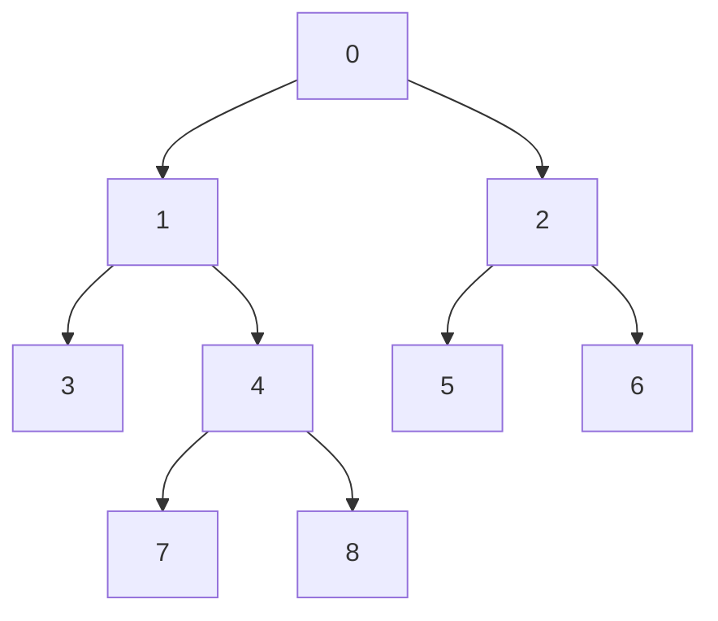

# Jump on Tree：从路径逐点走到重链、位掩码和离线分桶

## 题意与同一棵小树上的完整例子

树中任意两点之间只有一条简单路径。查询 `s,t,k` 要求从 s 出发向 t
走 k 条边后到达的顶点，起点对应 k=0；超过路径边数就输出 -1。
`N,Q≤500000`，点编号任意，输入给出无向边，没有“父编号小于孩子”的条件。
题面与参数见 [`task.md`](../../../upstream/tree/jump_on_tree/task.md)、
[`info.toml`](../../../upstream/tree/jump_on_tree/info.toml)。

以下以 0 为根只是为了预处理，原查询不需要指定根：



```text
输入                         输出
9 8                          7
0 1                          1
0 2                          0
1 3                          2
1 4                          6
2 5                          -1
2 6                          4
4 7                          -1
4 8
7 6 0
7 6 2
7 6 3
7 6 4
7 6 5
7 6 6
7 8 1
4 4 1
```

路径 `7→6` 是 `[7,4,1,0,2,6]`，共五条边、六个点；最后一问起终点
相同，唯一合法步数是 0，所以走一步不存在。方向不可忽略，反向查询的
第 k 个点一般不同。

## 最直观的算法：每问重新找路径

从 s 做 DFS，记录父亲直到找到 t，再沿记录反向恢复路径，取第 k 项。
单问最坏 `O(N)`，五十万问可到 `O(NQ)`。也可先固定根、存每点父亲和
深度，再让两个端点逐边向上相遇，仍会在长链上每问走 `O(N)` 条边。
需要共享的是同一棵树反复出现的祖先路段。

令 `c=LCA(s,t)` 为两条根路径最深的公共点，depth 是到根的边数，则

```text
up   = depth[s]-depth[c]
down = depth[t]-depth[c]
distance = up+down
```

若 `k>distance` 无解；若 `k≤up`，答案为 s 的第 k 级祖先；否则从 t
倒着走 `distance-k` 步即可。示例 `s=7,t=6` 的 c=0，up=3、down=2；
k=4 已在向下半段，改求 6 的第 `5-4=1` 级祖先，得到 2。
所以任务拆成两项：求 LCA，以及求某点指定距离的祖先。单做 LCA 还不够。

## 上游 `correct.cpp` 实际使用重链剖分

上游 [`correct.cpp`](../../../upstream/tree/jump_on_tree/sol/correct.cpp)
走 `solve→Graph::build→HLD→jump`，没有实例化倍增表。Graph 把无向边
整理为连续邻接段 CSR：每点用起止下标定位自己的所有邻边。
HLD 的第一趟递归 `dfs_sz` 求 parent、depth、子树大小，并把最大孩子
移到邻接段前方；第二趟 `dfs_hld` 先走该孩子，生成位置 `LID`、反查数组
V、子树右端 `RID` 和每点所在链的链头 head。

### 为什么只挑最大孩子就能减少跳跃次数

把一个点连向最大孩子的边称为重边，其他孩子边称为轻边。连续重边组成
一条链。若走向轻孩子 v，另有至少一样大的重孩子，因此
`size[parent]≥1+2*size[v]`；每向下跨一条轻边，子树规模至少减半。
所以任何根路径最多跨 `O(log N)` 条轻边。

DFS 优先访问重孩子使同链点在 `LID` 中连续，而且深度每增加 1，位置也
增加 1。为便于手算，平手时选择编号较小的孩子，示例可取：

| 重链 | 在一种合法剖分序中的位置 |
|---|---|
| `0→1→4→7` | 0、1、2、3 |
| `8` | 4 |
| `3` | 5 |
| `2→5` | 6、7 |
| `6` | 8 |

源码可能在平手时选择另一孩子，不影响不变量。这里 V 为
`[0,1,4,7,8,3,2,5,6]`。不应把原编号差误当成同链距离，连续的是剖分位置。

### LCA 与指定祖先各怎样查询

求 LCA 时，如果两点链头不同，就把较后分支的端点移到其链头父亲，
一次跳过一整条链；链头相同时，较浅点就是 LCA。上游按 LID 的先后
比较并交换端点，移动较后的一侧。由于子树连续且重链先遍历，跨到链头
父亲不会跳过两点的公共祖先。

求 v 的第 k 级祖先时，令 h=head[v]。如果 k 不超过当前点到链头的
距离，直接返回 `V[LID[v]-k]`；否则减去 `depth[v]-depth[h]+1`，
令 v=parent[h]，继续。示例从 6 向上两步：先跨单点链 6 到 2，
剩一步；再跨链头 2 到 0，剩零步，返回 0。从 7 向上两步则在同链内，
直接查 `V[3-2]=V[1]=1`。

上游 `jump` 还对 k=1 特化：s=t 返回 -1；t 不在 s 子树内就返回
parent[s]；否则从 t 找深度为 `depth[s]+1` 的那个祖先，即路径上的
下一孩子。这避免为“一步跳”完整执行一般路径公式。
其他 k 才先求 LCA、判越界，再执行一次祖先查询。

预处理 `O(N)`、额外空间 `O(N)`，LCA 与祖先查询各 `O(log N)`，合起来
仍是每问 `O(log N)`。源码两趟 DFS 是递归，长链深度可达 N；索引本身
并不需要这么深的进程栈，显式遍历序可以消除这项实现条件。

## 当前前五与审阅边界

[`global.json`](global.json) 的 **2026-09-26 05:09:47 UTC** 快照按
不同用户取前五，均为当时最新版本 AC，缓存语言均为 C++（`cpp`）。
源码和哈希见 [`config.json`](../../selected/jump_on_tree/config.json)。
本题没有归档 `candidate_pool.json`，以下“代表”限定为本次这五份，
不代表已搜索全部在线或离线算法的最快实现。最新状态与实际重测 ID 分开记录。

| 名次 | 提交 / 用户 | 时间 | 实际路线 |
|---:|---|---:|---|
| 1 | [#403437](https://judge.yosupo.jp/submission/403437) / nandhagk，[源码](../../selected/jump_on_tree/403437.cpp) | 56 ms | 在线链摘要、小子树祖先掩码、路径/星形特化 |
| 2 | [#405027](https://judge.yosupo.jp/submission/405027) / Rohan_Kapri，[源码](../../selected/jump_on_tree/405027.cpp) | 59 ms | 与第一份规范化行尾后相同 |
| 3 | [#270103](https://judge.yosupo.jp/submission/270103) / mukundan314，[源码](../../selected/jump_on_tree/270103.cpp) | 71 ms | XOR 叶剥离、深度 RMQ、查询分桶、祖先栈 |
| 4 | [#270100](https://judge.yosupo.jp/submission/270100) / Anonymous，[源码](../../selected/jump_on_tree/270100.cpp) | 74 ms | 同一离线方案，查询和答案分开存 |
| 5 | [#278240](https://judge.yosupo.jp/submission/278240) / chaihf，[源码](../../selected/jump_on_tree/278240.cpp) | 121 ms | 在线 HLD，短距离直接爬父亲 |

## #403437 / #405027：先把树压成可直接搜索的摘要

两份入口是 `tree_jump_index<judge::execution>`，默认 `MicroSize=32`。
它们仍借助最大子树重链，但不在每问循环“跳到链头，再看下一条链”。
它们为大树路径预存经过的链头摘要，并把至多 32 点的小子树收进一个位掩码。

### 不存邻接表，怎样得到父亲、子树大小和重孩子

每点初始只存四个 32 位量：度数、所有邻居编号的 XOR、子树大小 1、
最大孩子。异或满足 `x xor x=0`，所以当前度数为 1 的叶子，其邻居
异或就是唯一未删除邻居。删除叶子 u 时，到 v 的记录中 XOR 掉 u、度数
减一，并把 u 的子树大小合并到 v；若更大，就更新 v 的重孩子。

固定根 0，给它的度数加 2，保证最后不会被当作叶子删除。初始把所有其他
叶子排队，每弹出一个叶子，就可能产生新叶子。开头小树可先删 3、5、6、
7、8，之后 2、4、1 依次具备删除条件。u 被删时唯一邻居就是它定根后的
父亲，记录保留下来；删除序反过来便是父亲先于孩子的处理序。
每边仅增减一次，`O(N)`，不用 `2(N-1)` 条显式邻接记录，也没有递归。

### 小子树中，一个 32 位字保存整条祖先路径

按重孩子优先分配位置，同一子树仍占连续区间。第一次进入一个大小不超过
32 的子树时，记其位置为 base；这棵子树中每点的 mask，记录从这个小根
到自身经过的顶点，各顶点用 `position-base` 的一位表示。
栈路径以外的分支不置位，所以它不是“区间内所有点”的掩码。

示例全树只有 9 点，默认参数下可整体放入一个小块。采用前述位置，
顶点 7 的祖先位集合是 `{0,1,2,3}`，顶点 8 为 `{0,1,2,4}`，
按位 AND 得 `{0,1,2}`。置位数为 3，表示共同根路径含三个点，
LCA 就在一基深度 3，也就是顶点 4。

指定祖先也变为位选择：要第 3 个路径点，就取 mask 中从低到高第 3 个 1，
得到位置 2，再读 `inverse[base+2]`。由于父亲的位置在后代之前，位顺序
就是路径深度顺序。源码 `first` 存**一基深度**，`first-popcount(mask)`
是小块根的父亲深度；目标若高于这个边界，转去下面的大树摘要查找。

AVX2 版本在 CPU 同时支持 BMI2 时，用 PDEP 把 `1<<rank` 按 mask 的
置位位置展开，再 `ctz` 得到所选偏移。例如 mask=`10111₂`，rank=3
表示第四个 1，PDEP 得 `10000₂`，偏移为 4。它省掉逐个清最低位的循环。
这依赖 32 位块长和目标 CPU；文件给 GCC 设置 AVX2、BMI2、POPCNT、LZCNT。

### 大树部分保存链起点，而不是每个祖先

一个摘要项打包为 `(链头的一基深度<<32)|链头的位置`。沿重边前进不用
增加项，因为同链内位置随深度线性变化；跨轻边且新子树仍大于 32 时，
复制父路径摘要并追加一个链头。轻边至多 `O(log N)`，因此每条摘要很短。

为了在小图上同时看到两层，仅在教学中把 MicroSize 改为 2。示例根链
`0→1→4` 对应摘要 `[(1,0)]`；从根走到另一个大分支 2，则摘要为
`[(1,0),(2,6)]`。后面的 5、6 等叶子可各自成为小块。
想在 6 的路径上找一基深度 2，找到不超过 2 的最后一个链头 `(2,6)`，
再查 `inverse[6+(2-2)]`，得到 2；找一基深度 1 则选 `(1,0)`，得到根。

不同摘要求 LCA 深度时，比较它们从前到后的共同部分。首个不同链头表示
两根路径开始分开，LCA 在这两个新链头的上方；取两者链头深度减一的
较小值，并与双方小块边界取最小。若指向同一摘要，只需比较边界深度；
若属于同一小块，则直接用 mask 交集。它不需要输出 LCA 顶点，只需得到
其深度，就能应用开头的路径公式。

`Kernel::mismatch` 每次把四个 64 位摘要项装入 AVX2，逐槽比较是否相等，
用四位掩码定位首个不同槽。`predecessor` 同样四槽并行比较链头深度，
找最后一个不深于目标的项。摘要尾部加足够哨兵，允许固定宽度加载。
这里并行的是一个查询的四个摘要项，不是四条独立树查询。

设块长 B=32，大子树轻链头数可界为 `O(N/B)`，每份摘要至多 `O(log N)`
项，所以构造/存储约 `O(N+(N/B)log N)`，一般查询最坏仍要扫描
`O(log N)` 个短摘要项，不能仅因用了 SIMD 就写成一般 `O(1)`。
小块内查询为固定次数位运算。连续摘要以空间和复制工作换掉多次父链跳转。

### 路径、星形和读入批次还省了哪些工作

若最大度数不超过 2，树是一条路径：从叶子排列全部顶点，查询直接按位置
加减 k。若有度数 N-1 的中心且其余均叶子，树是星形：路径至多两条边，
只需判断端点、中心和步数。这两类的构造 `O(N)`、查询 `O(1)`，
不会先建通用摘要再查询。k=0 也在最前直接返回起点。

`tree.jumps` 每次最多读 64 个查询，预取八条查询之后要用的顶点元信息，
再顺序调用 `jump`。这是有界的前瞻缓冲，不是下节保存全体 Q 问并重排的
离线分桶；单条索引也可以独立在线查询。源码的优化 I/O 路径依赖 Linux
普通文件输入和约定数值格式。56 与 59 ms 对应同一代码，不构成两种算法
优劣的证据。

## #270103 / #270100：离线把祖先查询变成栈下标

### 不求 LCA 顶点，只求其深度

两份同样用邻居 XOR 与度数剥叶，固定根 0；#270103 把根度数置 0，
根被减后的无符号值不会变成待删除的 1。叶删除时积累子树大小，保留父亲，
倒序处理得到深度，再按子树长度分配连续 DFS 位置。这不依赖原编号顺序。

对任意不同的 DFS 先序位置 l<r，区间 `(l,r]` 的最小顶点深度减一，
就是两点 LCA 的深度。原因是区间仍在 LCA 子树内，却不含 LCA 本身；
它至少包含一次从 LCA 进入目标分支的孩子，该孩子深度恰好为
`depth[LCA]+1`。其他点都不可能更浅。若一个端点就是 LCA，同样要进入
它的一个孩子，论证不变；两端相同则直接使用该点深度，不查空区间。

例如取 DFS 序 `[0,1,4,7,8,3,2,5,6]`，深度数组为
`[0,1,2,3,3,2,1,2,2]`。7、6 的位置为 3、8，中间 `(3,8]`
的深度 `[3,2,1,2,2]` 最小为 1，减一得 LCA 深度 0。
7、8 中间只有深度 3，减一得 2，对应顶点 4 的深度。

RMQ 每 16 项存块前后缀，完整块最小值建重叠稀疏表；同块最多扫描 16
项，跨块读两边摘要和中间块表。重叠正确因为 `min(x,x)=x`，详细推导见
[`Static RMQ`](../staticrmq/analysis.md)。这里存的是**深度**，不是 LCA
题依赖父编号顺序的“父编号最小值”。源码表容量和层数按最大 N 静态配置，
部分建表循环也跑固定容量；小实例不会按实际 n 等比例缩小全部工作。

### 查询怎样分桶，再用一次遍历回答

读入每问后，应用路径公式，把合法查询改写为“DFS 位置 pos 的顶点向上
走 d 步”，无解放在哨兵桶 N。例如 `7→6,k=4` 改成 `(pos[6],1)`；
`7→6,k=2` 改成 `(pos[7],2)`；`7→6,k=6` 进入无解桶。

先数每个桶有多少问，再对计数求前缀和，按查询 ID 填入连续桶区间。
这叫计数排序，键只有 `0..N`，时间 `O(N+Q)`，无需 `O(Q log Q)` 比较排序。
最后按 DFS 序走一遍，维护当前根路径栈：到新点 u 时，先弹出旧分支，
直到栈顶为 parent[u]，再压入 u。此时栈底到栈顶恰为根到 u 的路径，
其第 d 级祖先直接是 `stack[top-d]`。

走到 7 时栈为 `[0,1,4,7]`，桶中的“上跳 2”读出 1；
走到 6 时栈为 `[0,2,6]`，“上跳 1”读出 2。各查询按原 ID 存答案，
最后统一按输入顺序输出。上下栈总次数 `O(N)`，所有桶处理总计 `O(Q)`。

按可随 n 缩放的同类结构计，预处理
`O(N+(N/16)log(N/16))`，查询归约最坏每问 16 项局部 RMQ，批量祖先
阶段 `O(N+Q)`，总空间还要加 `O(Q)`。它省掉每问 HLD 或倍增的祖先跳转，
代价是必须先读完查询，不能用于后续查询由上一答案决定的交互场景。

#270103 用两条数组 qs、qi 存转换后的端点桶和距离，之后 qs 复用为答案；
#270100 用 pair 数组存这两量，另有 out 数组。两者都在查询归约结束后
把 `rmq.data` 复用为桶内查询顺序，把 depth 复用为根路径栈。数组复用
必须遵守生命周期：尚有 RMQ 查询或仍需要原深度时不能提前覆盖。
两份 I/O 都是宏替换后的自定义缓冲 IO，而非普通 cin/cout。

## #278240：把 HLD 的短路径直接展开

这份仍是在线 HLD，`build_step_1` 递归算子树大小与重孩子，
`build_step_2` 递归排重链序，邻接采用固定数组的前向星，而非上游 CSR。
`lca` 在两点深度都小于 32 时逐边对齐并爬父亲；一般情况才跳链头。
`jump(u,d)` 的 d 是**目标深度**，若只需上爬不到 32 步，直接循环父亲；
否则跳过链头，最后以 `id2node[node2id[u]-depth[u]+d]` 定位。

例如开头所有小树查询都会进入短路；这不意味着源码没有 HLD，长链或更深
分支仍走通用路径。阈值 32 用可预测的短循环换掉链头分支，是否获益取决于
查询距离分布。主复杂度与上游相同，预处理/空间 `O(N)`、查询 `O(log N)`
加固定上限短扫描，仍有递归深度的实现条件。输入输出使用自定义映射读入、
小整数解析和缓冲写出。

## 适用范围与验证

本仓库的 [`offline_dfs_bucket.cpp`](../../../problems/tree/jump_on_tree/offline_dfs_bucket.cpp)
和 [`heavy_light_decomposition.cpp`](../../../problems/tree/jump_on_tree/heavy_light_decomposition.cpp)
分别保留离线与在线路线，说明见 [`tutorial.md`](../../../problems/tree/jump_on_tree/tutorial.md)。
其中历史 benchmark 的公共对照还是当时的 #270103，不能当作本轮已对
#403437 重新测量。另存 #275650 是个人旧快照，本篇未将其当作当前前五。

验证可在小树用逐点恢复路径作参照，覆盖同点、k=0、恰到终点、超出一步，
以及链、星、平衡树和长链带少量分叉。特别要跨过 MicroSize=32 的子树
边界，分别触发同小块、不同小块同摘要、不同摘要三种查找。
性能实验应分别记录构造、LCA 深度定位、祖先定位和读写，固定 I/O 后再
比较 HLD、摘要与离线分桶。本篇仅核对缓存、执行路径及教学例子，没有
访问 OJ 或新增性能 benchmark。
