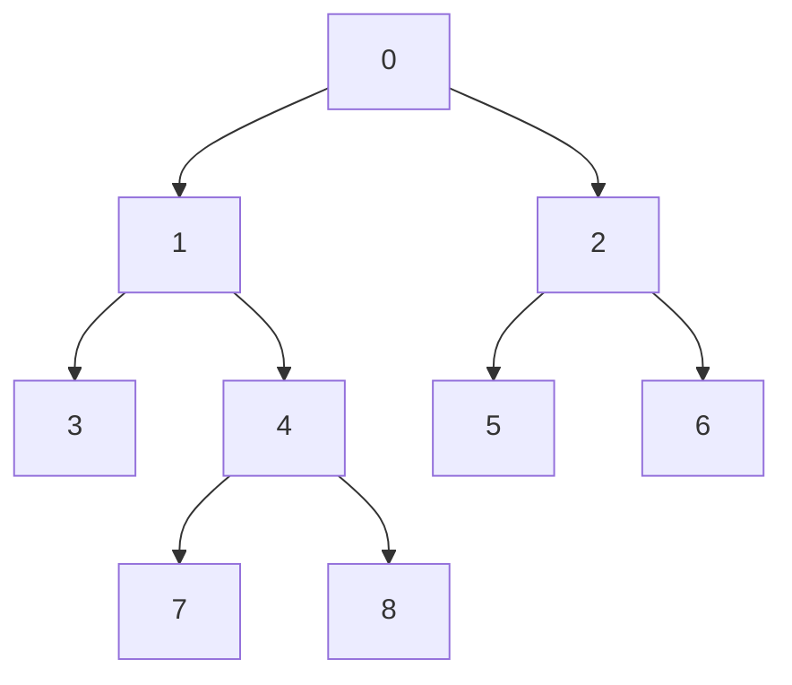

# LCA：从沿父边上爬到公开快解

## 先手算题目：两条根路径最后在哪里重合

根固定为顶点 `0`。输入给出每个非根顶点的父亲 `p[v]`，一次查询给出
两个不同顶点 `u,v`，要求它们的**最近公共祖先**。祖先包括顶点自己；
“最近”指公共祖先中离根最远的那个，不能按两点编号接近程度判断。
约束是 `2≤N≤500000`、`1≤Q≤500000`、`p[v]<v`、`0≤u<v<N`。
树不会修改，查询也不依赖先前的答案，所以既可读一问答一问，也可先收齐查询。

下面整篇沿用这棵树，父数组为 `p[1..8]=[0,0,1,1,2,2,4,4]`：



一份完整输入及其输出是：

```text
输入                         输出
9 5                          1
0 0 1 1 2 2 4 4              4
3 8                          0
7 8                          1
5 8                          0
1 7
0 6
```

例如 `3` 的根路径是 `0→1→3`，`8` 的根路径是 `0→1→4→8`，
最后重合在 `1`；`7,8` 最后重合在 `4`；`5,8` 只有公共祖先 `0`。
查询 `1,7` 的答案是 `1` 本身，查询 `0,6` 的答案是根。

## 最直观的算法：把深的点一步步往上移

定义 `depth[v]` 为根到 `v` 的边数。因为父亲编号更小，读入 `p[v]` 时
就能计算 `depth[v]=depth[p[v]]+1`，不需要先建邻接表再遍历。
令两点先到相同深度，随后同时上移，第一次重合的位置就是答案：

```text
while depth[u] > depth[v]: u = p[u]
while depth[v] > depth[u]: v = p[v]
while u != v:
    u = p[u]
    v = p[v]
return u
```

在同层阶段，两个点还没相遇时，它们的公共祖先都在各自上方；一起移动
不会跳过最近公共祖先。预处理 `O(N)`、空间 `O(N)`，每问最坏 `O(H)`，
`H` 是树高。链树的 `H=N-1`，五十万次长距离查询可能接近
`NQ=2.5×10^11` 次父指针访问。下一步要解决的是“相同的上爬路段反复走”。

## 沿上游 `correct.cpp` 推导倍增

[`correct.cpp`](../../../upstream/tree/lca/sol/correct.cpp) 实际执行的是
**倍增祖先表**。把一次能跳的距离从 `1` 条边扩展为 `1,2,4,8,…` 条边：

```text
anc[0][v] = p[v]
anc[k][v] = anc[k-1][anc[k-1][v]]
```

`anc[k][v]` 表示从 `v` 向上走 `2^k` 条边后的顶点；不存在时存 `-1`。
第二行成立，因为两次 `2^(k-1)` 步正好是 `2^k` 步。上游在中间祖先为
`-1` 时直接写 `-1`，不会拿 `-1` 当数组下标。示例的主要表项如下；
对 `N=9`，源码还分配了全为 `-1` 的第 3 层。

| 顶点 `v` | 0 | 1 | 2 | 3 | 4 | 5 | 6 | 7 | 8 |
|---|---:|---:|---:|---:|---:|---:|---:|---:|---:|
| `dps[v]` | 0 | 1 | 1 | 2 | 2 | 2 | 2 | 3 | 3 |
| `anc[0][v]`，跳 1 步 | -1 | 0 | 0 | 1 | 1 | 2 | 2 | 4 | 4 |
| `anc[1][v]`，跳 2 步 | -1 | -1 | -1 | 0 | 0 | 0 | 0 | 1 | 1 |
| `anc[2][v]`，跳 4 步 | -1 | -1 | -1 | -1 | -1 | -1 | -1 | -1 | -1 |

上游 `main` 的执行顺序是读父数组并填 `dps/anc[0]`，按层构造 `anc`，
再让查询 lambda 做两个阶段：

1. **对齐深度。** 较深点需要上移 `dist` 步。任何非负整数都能写成二进制
   幂之和，例如 `13=8+4+1`；从大层向小层检查，所需跳跃不超过 `log₂N` 次。
2. **停在 LCA 的下一层。** 已同层且不同的两点，从大到小检查 `anc[k]`。
   两个 `2^k` 祖先不同才一起跳；相同则不跳，因为这次跳跃可能越过 LCA。
   循环结束时两点不同、父亲相同，返回这个父亲。

手走 `LCA(6,7)`：先把深度 3 的 `7` 上移到 `4`，得到同层的 `6,4`。
跳 2 步时祖先同为 `0`，不跳；跳 1 步时祖先分别是 `2,1`，于是移到
`2,1`，最后返回共同父亲 `0`。若对齐后已经重合，如查询 `1,7`，可立即返回。
第二阶段的循环不变量是“两点同层、仍在 LCA 下方、LCA 不变”。

这把每问 `O(H)` 降为 `O(log N)`，代价是预处理和空间均为 `O(N log N)`。
`N=500000` 时源码 `lg=19`，仅祖先表就有 `9500000` 个 `int`，约
38 MB；每问又需扫两轮层数并读取与端点有关的表位置。快解接下来减少的
就是这张大表、每问逐层判断及分散的祖先访问。

## 先把 LCA 变成一个数组上的最小值

### 本题的特殊归约：DFS 位置之间取父编号最小值

DFS 先序是“访问顶点，再完整访问它的每棵子树”得到的顺序。它的关键性质是
**任意子树的所有顶点连续出现**。孩子可以按任意顺序访问；#278239 采用
与孩子编号相反的顺序，示例实际得到：

| DFS 位置 | 0 | 1 | 2 | 3 | 4 | 5 | 6 | 7 | 8 |
|---|---:|---:|---:|---:|---:|---:|---:|---:|---:|
| 顶点 | 0 | 2 | 6 | 5 | 1 | 4 | 8 | 7 | 3 |
| 进入此点的边的父端 `F` | 无 | 0 | 2 | 2 | 0 | 1 | 4 | 4 | 1 |

设 `l=min(pos[u],pos[v])`、`r=max(pos[u],pos[v])`，则
`LCA(u,v)=min(F[l+1..r])`，这里右端包含在内。必须排除 `F[l]`：
它是**进入较早端点**的边，可能来自正确答案的父亲。

为什么公式成立？令答案为 `w`。从较早端点走到较晚端点之前，DFS 不会离开
`w` 的整棵子树，因此区间中各进入边的父端都是 `w` 或它的后代。又有
`p[v]<v`，这些编号都至少是 `w`。如果较早点就是 `w`，区间包含进入通向
另一点的孩子的边；否则两点在 `w` 的不同孩子子树，进入后一分支的边也
在区间内。这条边的父端恰好是 `w`，所以最小值既不小于 `w`，又取到了 `w`。

示例查询 `3,8` 的位置为 `8,6`，读取 `F[7..8]=[4,1]`，得到 `1`；
`7,8` 只读取 `F[7]=4`；`5,8` 读取 `[0,1,4]` 得到 `0`。
这不是对原顶点编号区间求最小值，必须先换成 DFS 位置。

### #278239 怎样不建树边就算出这个顺序

先逆序处理顶点，累加 `desc[p[v]] += desc[v]+1`，求出每点的后代数。
父编号小于子编号保证处理父亲之前已统计好所有孩子。示例初值为
`[8,4,2,0,2,0,0,0,0]`。接着正序处理每条父边，复用这同一个数组：

```text
w = node2id[parent[v]]       // 父亲剩余区间的右端游标
d = node2id[v]               // 此时仍是 v 的后代数
node2id[v] = w               // 给 v 的子树预留长 d+1 的尾段
node2id[parent[v]] = w-d-1   // 父亲游标移到前面剩余部分
```

例如先把顶点 `1` 的五个位置预留为 `[4,8]`，根游标从 `8` 移到 `3`；
再把顶点 `2` 的三个位置预留为 `[1,3]`，根游标归 `0`。处理 `1` 的孩子时，
先给 `3` 留 `[8,8]`，再给 `4` 留 `[5,7]`，`1` 自己最终停在位置 `4`。
每次预留的长度正好是子树大小，所以区间不会重叠，也不会留下空洞。
最终 `node2id=[0,4,1,8,5,3,2,7,6]`，才是供查询使用的 DFS 位置。

这两趟各 `O(N)`，省去邻接表和 DFS 栈。`F` 只有 `N-1` 个有意义的父值；
#278239 实际分配 `N` 个槽，根槽为占位值且查询不读取它。其他版本也有
减一存放的写法，应先核对下标再对照公式。查询约束保证 `u!=v`；若做通用
库，必须另外处理 `u==v`，否则会向 RMQ 传入空区间。

### 最小值怎样快速查询：只给完整块建大表

RMQ 是 range minimum query，即静态数组的区间最小值。先考虑给每个位置
存长度为 `1,2,4,…` 的区间最小值 `st[k][i]`。长度为 `len` 的查询可用
两段长度 `2^floor(log₂len)` 覆盖，两段可以重叠，因为 `min(x,x)=x`。
例如查询六项，合并左四项与右四项，重复覆盖中间两项不会改变最小值。
这使查询只读两个表项，却又付出了 `O(N log N)` 的大表。

分块把这笔费用限制到块数上。教学取块长 `B=4`，令数组为
`[0,2,2,0 | 1,4,4,1 | 7,3,6,5]`。每块向右扫一次建前缀最小值，
向左扫一次建后缀最小值，再给块最小值 `[0,1,3]` 建稀疏表：

| 块 | 原值 | 前缀最小值 | 后缀最小值 |
|---|---|---|---|
| 0 | `0,2,2,0` | `0,0,0,0` | `0,0,0,0` |
| 1 | `1,4,4,1` | `1,1,1,1` | `1,1,1,1` |
| 2 | `7,3,6,5` | `7,3,3,3` | `3,3,5,5` |

查询半开区间 `[2,11)` 分成左边 `[2,4)`、整块 `[4,8)`、右边 `[8,11)`，
分别读后缀 `0`、块表 `1`、前缀 `3`，答案是 `0`。每个原位置只维护
两条线性数组，大表缩小为 `M≈N/B` 项上的 `O(M log M)`。
同块查询如 `[5,7)` 不能直接合并该块的前后缀，否则会混入值 `1`；
这些实现选择扫描查询范围内的 `[4,4]`，得到 `4`，最多访问 `B` 项。

#278239 的 `B=64`，所以预处理/空间为 `O(N+(N/64)log(N/64))`，
跨块每问 `O(1)`、同块最坏 `O(64)`。实际源码的变量名有反直觉之处：
`suf` 是正向生成的**块前缀**，`pre` 是反向生成的**块后缀**；应按构造
方向理解，不能仅凭名字抄公式。更完整的分块、位掩码与不相交表推导见
[`Static RMQ 教程`](../staticrmq/analysis.md)。

## 证据与范围

2026-09-26 05:09:56 UTC 的已缓存前五快照确认下列 ID、账号、时间和
`is_latest=true`；源码哈希见 [`global.json`](global.json)。
另从不按用户去重的 [`candidate_pool.json`](candidate_pool.json) 读取当前测试
版本 AC 的前 100 条，抓取时间为 03:50:46 UTC；选满前跳过 56 条旧版本成绩，再逐份寻找不同的
实际执行路径。所说的「某族最快」仅指
这 100 条中已经人工辨认的提交；更深排名、未重新测评的旧提交可能改变结论。
入选源码与元信息集中在 [`selected/config.json`](../../selected/lca/config.json)，
候选池未入选源码暂存于 `submissions/staging/lca/candidates/`。
以下代表提交的缓存语言均为 C++（`cpp`）。
OJ 时间不是本仓库同机控制实验，不宜把 1–3 ms 的差距解释成算法优势。
`is_latest=true` 是抓取时的详情状态，不等于本轮主动重测了该 ID；
本文只读本地缓存复核源码，没有访问 OJ 或发起重测。
题目约束 `0 ≤ p_i < i` 和 `0 ≤ u < v < N` 见
[`upstream/tree/lca/task.md`](../../../upstream/tree/lca/task.md)。

| 当前名次 | 提交 | 用户 | OJ 时间 | 实际主算法 |
|---:|---|---|---:|---|
| 1 | [#278239](https://judge.yosupo.jp/submission/278239) | chaihf | 24 ms | 特殊 DFS 序 + 64 元素块 RMQ |
| 2 | [#370969](https://judge.yosupo.jp/submission/370969) | Anonymous | 27 ms | 同一 DFS 序 + 64 元素块的 Cat Tree |
| 3 | [#362491](https://judge.yosupo.jp/submission/362491) | IceKylin | 27 ms | 同一 DFS 序 + Blocked Sparse Table |
| 4 | [#195957](https://judge.yosupo.jp/submission/195957) | andyli | 27 ms | 同一 DFS 序 + 16 元素分块 Sparse Table |
| 5 | [#354023](https://judge.yosupo.jp/submission/354023) | 2qbingxuan | 29 ms | Schieber–Vishkin 链标签与位掩码 |

前五覆盖两类在线算法；并非五种独立的 LCA 主算法。第 2、3、4 名虽然
RMQ 实现各异，都复用同一个特殊 DFS 序性质。扩展候选池与离线算法的
审阅记录见下节，不能由“前五没有离线法”推断其性能差。

| 扩展池原始名次 | 提交 | 用户 | 时间 / 内存 | 与前五不同的主路径 |
|---:|---|---|---|---|
| 55 | [#191763](https://judge.yosupo.jp/submission/191763) | pajenegod | 48 ms / 17.6 MB | 特殊 DFS 序 + 笛卡尔形状微块 RMQ |
| 67 | [#349403](https://judge.yosupo.jp/submission/349403) | Rac | 65 ms / 51.0 MB | 完整 Euler Tour 深度 RMQ |
| 94 | [#394144](https://judge.yosupo.jp/submission/394144) | Anonymous | 90 ms / 53.8 MB | Tarjan 离线并查集 |

候选池原始名次保留同一用户的多份提交，因而与前五的「不同用户名次」不是
同一指标。上述三个 ID 均已人工加入 `selected`；各自 `rank.scope` 为
`latest_raw_ac`。内存是 OJ 记录值，不是算法自身的峰值分配。

## 第一名 #278239：把 LCA 化为较短的 RMQ

源码主路径位于 [#278239 源码](../../selected/lca/278239.cpp) 末尾。先逆序累计
子树大小，再顺序用父节点维护的位置计算 `node2id[v]`，无需建邻接表或
递归 DFS。按该序把 `parent[v]` 放入数组 `id2node`。若两个不同顶点的
序号为 `l < r`，则：

```text
LCA(u, v) = min(parent_at_dfs_order[l+1 ... r])
```

区间中至少有一条边从最近公共祖先进入目标分支，其父编号正好是 LCA；
其余边的父编号不会更小，因为祖先编号总小于后代。约束还保证查询端点
不同，因此源码不处理空区间；把它当作通用 LCA 库使用时需增加 `u == v`
分支。

RMQ 每 64 项成块，保存块内前缀/后缀最小值，只给完整块建稀疏表。
跨块查询读取两个边缘预计算值和至多两个稀疏表值；落在同块时顺序扫
至多 64 项。预处理约 `O(N+(N/64)log(N/64))`，查询最坏 `O(64)`，
空间约 `O(N+(N/64)log(N/64))`。固定块长下可视为常数查询，但
同块查询的常数与查询分布有关。相比上游，它大幅缩小了跳表并删除
每问 `log N` 层随机祖先访问。

在 `N=500000` 时只有约 7813 个 64 元素块，块稀疏表约 13 层、
上界约 10 万个 32 位条目（约 0.4 MB），而块内前后缀和原数组仍为
线性空间。小区间是否落在同块取决于 DFS 位置，不能只从端点编号判断。

其 `rd::uh()` 与 `wt.uw()` 是手写快速整数 I/O，配合静态数组、顺序
预处理。这些工程优化同样贡献时间，不能把全部收益归于 RMQ。

## 第二名 #370969：Cat Tree 的跨块 RMQ

[#370969 源码](../../selected/lca/370969.cpp) 的 `DFNLCA::init` 也通过逆序
子树大小和顺序父位置构造 DFS 编号；
`BlockCatTree::a[i-1] = fa[path[i]]`，查询取两个顶点编号之间的父值最小。
与第一名相同的是 LCA 到 RMQ 的归约、64 元素块及块内前后缀最小值。
不同的是完整块使用按二进制分叉点组织的 Cat Tree：每层为左右半区
预存前缀/后缀，查询按块下标最高不同位取两项。预处理和空间仍约
`O(N+(N/64)log(N/64))`；跨块查询 `O(1)`，同块扫至多 64 项。
这避免了常规稀疏表的区间对数长度选择，但多层数组写入模式和缓存
布局不同，不能仅靠 OJ 的 27 ms 判断它比第一名 RMQ 结构更快。

## 第三名 #362491：泛型 Blocked Sparse Table

[#362491 源码](../../selected/lca/362491.cpp) 的 `solve_main` 中
`parent_to_dfn(p)` 构造同一性质的序，`rev[dfn[i]] = p[i]`；
`BlockedSparseTable<RangeMin<uint32_t>, 64>` 完成最小值查询。
跨多个块时用两端块后缀/前缀和完整块的稀疏表；相邻块只用两端结果；
同块直接扫描。其 `RangeMin` 是幂等运算，完整块可用重叠区间回答。
预处理、空间与第一名同阶，查询最坏扫描 64 项。
这份源码展示“可复用泛型 RMQ + 针对本题的特殊 DFS 序”的组合。
泛型封装并未妨碍其进入前五，实际成本要靠同机 benchmark 而非源码行数
推测。读取父数组和查询端点时使用专门的小整数输入路径。

## 第四名 #195957：同一归约，16 元素分块稀疏表

[#195957 源码](../../selected/lca/195957.cpp) 这份 34 KiB 模板源码含有
通用 Tree/HLD 类，但 `main` **没有调用它**。
实际执行的是 `fa_to_lid(fa)` 建序、`st.a[lid[i]-1]=fa[i]`，随后
`Static_Range_Product<Sparse_Table, Monoid_Min<int>>` 查询
`st.prod(u,v)`。因此将它标作 HLD 会误判其算法。

必须继续进入 `Static_Range_Product::build2/prod` 才能看清结构：模板参数
`LG=4`，即每 16 项一块；`pre/suf` 存块内前后缀，而内层
`Sparse_Table` **只对 `n >> 4` 个块最小值建表**。同块查询仍逐项扫描。
所以预处理、空间为 `O(N+(N/16)log(N/16))`，每问最多扫描 16 项；
它与前 3 名属于同一主算法族。OJ 报告的约 16.8 MB 内存也与分块表相符，
不能把外层模板名里的 `Sparse_Table` 误读成全长表。与上游相比，查询
不再逐层跳祖先，而是处理一个较短的静态 RMQ。

## 第五名 #354023：线性空间常数查询

### 链标签到底把哪些信息压进了整数

倍增保存的是“走某个长度后到哪里”，RMQ 保存的是“区间里最小的是谁”。
这一份改成把树划成若干条竖直链，记录根路径经过的**链的层级**。
每问先找包含答案的共同链，再把两端点各移到该链上。

先定义两个位操作：`lowbit(x)=x&(-x)` 取最低的一个 1，例如
`lowbit(12)=lowbit(1100₂)=4`；`bit_floor(x)` 取最高的一个 1，例如
`bit_floor(12)=8`。以下取负和位掩码均按无符号整数解释。
给叶子从 `1` 起编号，使每棵子树的叶号形成连续区间。示例的叶号是
`3→1、7→2、8→3、5→4、6→5`。顶点的 `chain` 取自己区间中
`lowbit` 最大的叶号：

| 顶点 | 子树叶号区间 | `chain` | `lowbit(chain)` | 源码 `asc`（二进制） |
|---:|---|---:|---:|---|
| 0 | `[1,5]` | 4 | 4 | `000` |
| 1 | `[1,3]` | 2 | 2 | `010` |
| 2 | `[4,5]` | 4 | 4 | `100` |
| 3 | `[1,1]` | 1 | 1 | `011` |
| 4 | `[2,3]` | 2 | 2 | `010` |
| 5 | `[4,4]` | 4 | 4 | `100` |
| 6 | `[5,5]` | 5 | 1 | `101` |
| 7 | `[2,2]` | 2 | 2 | `010` |
| 8 | `[3,3]` | 3 | 1 | `011` |

为什么区间中的最大 `lowbit` 是唯一的？若两数最低 1 都在第 `k` 位，
它们之间必有一个能被 `2^(k+1)` 整除的数，它的 `lowbit` 更大，因此
二者不可能并列成为整个连续区间的最大值。一个父亲只能和包含这个唯一
叶号的一个孩子共享标签；沿这一路径直到该叶子，标签保持相同。
所以示例分成 `0→2→5`、`1→4→7`、单点 `3`、单点 `6`、单点 `8` 五条链。
路径离开某条链后，新链的 `lowbit` 严格变小，最多经过 `O(log N)` 个层级，
可以用一个机器字的不同位表示。

源码的 `build` 做五趟线性扫描：逆序求叶数 `sz`；正序用叶数切分区间；
把内部顶点的暂存标签清零；逆序传播 `lowbit` 最大的孩子标签；记录链顶父亲
并正序生成 `asc`。其中 `chain_pa[t]` 表示标签 `t` 的链顶上方那个父亲。
同链有多个顶点写这个槽，逆序顶点遍历让编号最小、也就是最高的顶点最后
覆盖，故最终保存的是链顶父亲。例如 `chain_pa[1]=1`、`chain_pa[3]=4`。

严格按这份源码，`asc[0]=0`，非根点使用
`asc[v]=asc[p[v]] | lowbit(chain[v])`，即 OR 合并根以下路径的链层级。
根链的位会在访问同链非根点时加入；不应把源码的根项直接写成
`lowbit(chain[0])`。没有保留下来的公共层级时，查询通过 `chain_pa` 跳到
根 `0`，这与根标签对应的 `chain_pa` 为 `0` 配套。

### 手走一次位运算查询

`asc` 只记“层级”，相同层级可能出现在不同分支。因此直接取两掩码的交集
还不能说明它们共享同一条链：示例顶点 `3,8` 的 `asc` 都是 `011`，
但其最低层级的链标签分别是 `1,3`，是两条不同的链。
这正是异或标签要解决的问题。两标签最高的不同位确定分叉尺度，清除更低的
层级后，交集才保留两条路径真正共同的高层链：

```text
if chain[u] == chain[v]: return min(u,v)
h = bit_floor(chain[u] xor chain[v])
J = asc[u] & asc[v] & (-h)       // 清掉 h 以下的位
for x in [u,v]:                 // 仅固定两个端点，并非沿树循环
    K = asc[x] xor J
    if K != 0:
        k = bit_floor(K)
        t = (chain[x] & (-k)) | k
        x = chain_pa[t]
return min(u,v)
```

`K` 中最高的位是端点路径尚未消去的最高层链；标签恢复式清除低于 `k`
的位，再把 `k` 置 1，得到要离开的那条链的标签。一次 `chain_pa` 访问就
越过整条链，省掉逐边或逐层跳跃。两端调整后落在包含 LCA 的同一条链上，
较浅者就是 LCA；这里仍利用父编号更小，才可用 `min(u,v)` 选较浅点。

查询 `3,8`：标签 `001,011` 异或得 `010`，故 `h=2`；
`J=011 & 011 & ...110 = 010`。两端的 `K` 都是 `001`，恢复标签仍为
`1,3`，分别跳到 `chain_pa[1]=1` 和 `chain_pa[3]=4`，最后返回 `min(1,4)=1`。
查询 `7,6` 则得到 `h=4、J=0`，两端各借链顶父亲跳到根，返回 `0`。
同链查询如 `1,7` 连这些位运算都可跳过，直接返回 `1`。

这需要树的标签规模装得进一个机器字；本题五十万点用 32 位即可。
把宇宙扩展到不能用一字保存标签时，不能照搬“常数次机器操作”的复杂度。

[#354023 源码](../../selected/lca/354023.cpp) 先利用 `p_i < i` 逆序统计
子树/叶区间权重、顺序分配区间标签，
再为每个顶点选择 `lowbit` 最显著的 `chain`。同一标签的顶点形成一条
祖先链；`asc` 的位掩码记录根路径经过的链层级，`chain_pa` 记录链顶
上方的父节点。一次查询用异或确定两条标签分歧的最高位，交集掩码定位
共同链，再各跳一次，返回两个候选中编号较小者。

预处理 `O(N)`、空间 `O(N)`、每问 `O(1)`，没有每问循环，也不用 RMQ
表。这里的一个关键捷径是 `p_i < i`，使同链上的编号大小反映祖先顺序；
一般树上不能直接以编号取 `min`。该法位运算多、证明与实现更复杂，
适合高查询量和想控制内存的场景。它在本机旧基准中曾比 RMQ 快解接近或
更快，而 OJ 排第五；需要在同机、同版本数据下复测才能作当前结论。

## 扩展池 #191763：用笛卡尔树形状消除块内扫描

前后缀分块在同块查询时仍要逐项比较。能否预先记下一个小块里**所有**
区间的最小值位置，并让形状相同的小块共享答案？例如 `[6,2,4]` 和
`[9,1,5]` 的所有区间最小值位置完全相同，因为它们都是中间元素最小、
左边和右边各一个元素。描述这种关系的笛卡尔树是：最小值位置做根，
左子区间和右子区间递归建树，树的中序位置仍是原数组位置。
只要树形相同，任意区间的最小值下标就相同，具体数值可以不存进共享表。

构造形状时从左到右维护值递增的栈，新值比栈顶小时弹栈，再压入新位置。
每项只入栈和出栈一次，所以编码是线性的。#191763 把入栈和出栈历史编码
成位串，查表参数为“形状、左偏移、右偏移”；表返回相对下标，再到原数组
读取真正的父编号。相等元素的选择必须和编码规则一致，这份代码仅在新值
严格更小时弹栈。这里共享的是**比较关系**，不是让不同块共用最小值数值。

[#191763 源码](../../selected/lca/191763.cpp) 也构造 `N−1` 项特殊 DFS
父数组，但 `RMQ::rmq<int>` 把它切成固定 7 项的微块。`rmq_helper` 在
编译期枚举长度为 7 的可行笛卡尔树形状，并对每个形状预存所有 `(l,r)`
的最小值下标。建表时，单调栈把每个实际微块编码成形状掩码；之后
**同块查询**仅需用 `(形状, 左端, 右端)` 索引查表，避免 #278239
至多 64 项的线性扫描。跨块则组合左、右微块查表值，以及对整块最小值
建立的普通稀疏表。

这是 Fischer–Heun 思路的常数块实现。固定 `B=7` 时，整块表仍有
`O((N/7)log(N/7))` 的构造与空间成本；不能因为使用笛卡尔形状就称
**这份代码**具有理论 Fischer–Heun 的全线性预处理。它的块更多，表写入
量高于 64 元素块方案，却省掉同块扫描。#191763 虽写成 `cin/cout`，
文件开头已用宏把它们替换为自定义 `IO` 对象，还覆盖 `operator new`
使用固定约 20 MiB 的内存池。48 ms 包含这些工程因素；目前没有
同机拆分实验来衡量微块本身。

## 扩展池 #349403：一般 Euler Tour + 深度 RMQ

特殊父编号最小值依赖 `p[v]<v`。若树编号任意，可以先重新编号，也可以
使用不依赖编号大小的 Euler Tour：进入顶点时记一次，从每个孩子回来后
再记一次当前顶点。这样记录的是 DFS 的整条行走轨迹；每条树边去、回各
走一次，所以共 `2N-1` 项，而不是只保存每点一次的先序。

仍用开头的树，这里按孩子编号从小到大走，得到：

```text
位置   0  1  2  3  4  5  6  7  8  9 10 11 12 13 14 15 16
顶点   0  1  3  1  4  7  4  8  4  1  0  2  5  2  6  2  0
深度   0  1  2  1  2  3  2  3  2  1  0  1  2  1  2  1  0
```

第一次出现位置 `first[3]=2、first[8]=7`。两位置之间的顶点是
`[3,1,4,7,4,8]`，最小深度为 `1`，对应顶点 `1`。DFS 从一个分支到另一个
分支必须回到两者 LCA，且在第二端点首次出现之前不必返回 LCA 的父亲，
所以区间最浅点就是 LCA。区间里可能多次出现同一个 LCA；选任意一次都对。

只存深度最小值还不能输出顶点，#349403 用 `(depth<<32)|vertex` 打包。
比较两个无符号 64 位值时先比较高 32 位深度，深度相同才比较顶点；查询
最终取低 32 位。任意编号不会破坏“深度优先”的比较关系。
与短父数组相比，Euler 归约要付出更多元素、深度、首次位置和子节点索引，
换来对任意树编号直接适用的性质。

[#349403 源码](../../selected/lca/349403.cpp) 的 `LowestCommonAncestor`
先把父数组转成连续存储的子节点 CSR（`child_start_`、`child_`），然后
用显式栈进行完整 Euler Tour，记录每个顶点第一次出现的位置。
进入子节点与从子节点返回都会写一项，因此 Euler 数组长 `2N−1`。
每项打包为 64 位 `(depth<<32)|vertex`；在两端点首次出现位置之间
取数值最小项，优先选最小深度，其低 32 位便是 LCA。这一归约不依赖
`parent[v]<v`；本题只在输入形式上给了父数组。

需要更正一个容易由模板名产生的印象：`RangeMin<u64,6>` 的
`block_shift=6`，也就是 64 项一块；内部 `SparseTable` 只给块最小值建
多层表，块内用前后缀/局部处理。不是对近 100 万项 Euler 数组直接建
完整稀疏表。复杂度约为 `O(N+(N/64)log(N/64))` 构造与空间、
固定上限的块内查询。它在 OJ 用 51.0 MB，明显高于前几份的
15–19 MB：`2N−1` 个 64 位 Euler 项、CSR、深度和通用容器都有成本。
若要在一般编号树复用，比特殊 DFS 归约更适合；若只攻本题约束，多存
这些数据未显示出速度收益。

## 扩展池 #394144：离线 Tarjan 并查集

在线结构为未来任意查询建立索引。若所有查询一开始就已知，还可以让一次
DFS 同时解决它们，这就是这里“离线”的含义。给查询 `(u,v,id)` 在 `u`
和 `v` 各挂一份记录，保证遍历到后访问的一端时能找到该查询。

并查集在这里保存“已处理完的顶点目前归到哪个活跃祖先”。初始每点各自
为根；`find(x)` 沿并查集父指针找代表元，同时把经过的指针直接改到代表元，
这叫路径压缩。注意并查集指针 `f` 和树的原父指针不是同一个东西：
尚未处理完的子树不能提前连给父亲。源码的核心顺序是：

```text
tarjan(u):
    visited[u] = true
    for 每个孩子 v:
        tarjan(v)
        f[v] = u
    for 挂在 u 的每个 (other,id):
        if visited[other]: answer[id] = find(other)
```

不变量是：处理 `u` 的查询时，`u` 的所有已完成孩子都合并到了 `u`；
此前完成的其他分支则已经沿递归返回链合并到与 `u` 的共同祖先。
源码的 `visited` 在**进入**时置位。如果另一端是仍在递归栈上的祖先，
它尚未连向自己的父亲，`find(other)` 就是它自身，仍然正确。因此不能
把这份实现写成“仅另一端出栈后才允许回答”的另一个版本。

按源码反向孩子顺序走示例：先完成 `2` 的子树并使 `f[2]=0`，再进入 `1`。
在 `1` 的子树里先访问 `4→8`，之后返回 `4` 才设置 `f[8]=4`；
返回 `1` 后设置 `f[4]=1`。随后处理顶点 `3` 的查询 `(3,8)`，
`find(8)` 沿 `8→4→1` 得到 `1`，并把 `8` 直接压到 `1`。
若查询另一端是早先的 `5`，其代表已到根 `0`，故得到跨根分支的答案。

每个顶点、树边、查询记录只做常数次外层工作，余下开销来自 `find`。
标准 Tarjan 可采用按秩合并、路径压缩，并另存 `ancestor[代表元]`，得到
`O((N+Q)α(N))` 的经典界；`α` 是增长极慢的反阿克曼函数。但这份源码
直接设 `f[v]=u`，只有路径压缩，**没有按秩合并，也没有单独的 ancestor 表**。
不能把带按秩合并的定理直接当成本实现的证明；按仅路径压缩的保守界，
可记总时间 `O((N+Q)log N)`，空间仍是 `O(N+Q)`。它消除的是每问预先
查跳表的流程，同时增加双向查询表、答案数组和批量读入的需求。

[#394144 源码](../../selected/lca/394144.cpp) 在回答前读入所有查询。
它以 CSR 方式存树边，还把每个查询分别挂到两个端点的查询邻接表。
`tarjan(u)` 先标记 `u` 已访问，递归处理子节点 `v`；子树处理结束后
将并查集父指针 `f[v]=u`。检查挂在 `u` 上的查询时，如果另一端点
已经访问，就令 `res[id]=find(other)`。此时已完成的子树被压缩到
当前公共祖先；尚未完成的子树不会被错误合并。因此在线回查 LCA 的
多层跳表被一次 DFS 与并查集路径压缩替代。

这份实现使用 `O(N+Q)` 空间，递归深度
在链树上可达 `N`，依赖 OJ 栈限制；一般工程复用应改为显式栈。
它必须先读完所有查询、最后按原顺序输出，不能流式在线回答。OJ
90 ms / 53.8 MB 反映了双向查询索引、答案数组、递归和 I/O 的合计，
不等同于并查集单步开销。另有 [#368676](../../staging/lca/candidates/368676.cpp)
在这批样本的原始第 97 位、93 ms，说明离线法并非仅一份孤例。

## 针对本仓库的打磨方向与验证边界

本地已有四种变体：
[`schieber_vishkin.cpp`](../../../problems/tree/lca/schieber_vishkin.cpp)、
[`block_rmq.cpp`](../../../problems/tree/lca/block_rmq.cpp)、
[`euler_sparse_table.cpp`](../../../problems/tree/lca/euler_sparse_table.cpp)、
[`tarjan_offline.cpp`](../../../problems/tree/lca/tarjan_offline.cpp)。
其证明、适用条件和旧基准解释见
[`tutorial.md`](../../../problems/tree/lca/tutorial.md)。
已见到至少四种值得独立维护的路径：特殊 DFS 序 + 块稀疏表、
特殊 DFS 序 + 笛卡尔微块、Schieber–Vishkin、Tarjan 离线法。
一般 Euler Tour 是处理不满足 `p_i<i` 的树的合理基线，也应保留作为
泛用版本。当前第一名的局部扫描与 #191763 的微块查表是直接可比的
瓶颈：同机对相同 DFS 序和 I/O，分别测同块、相邻块、远块查询，
才能判断更复杂的微块查表是否值得引入。Schieber–Vishkin 需要同时
评估构造成本、峰值内存与每问位操作；Tarjan 应在查询全部已知、
链树和分叉树两类极端上评估递归/显式栈与 CSR 构造成本。

此轮只审阅 OJ 前 100 条当前版本 AC 的代码与快照，尚未重新编译这些
公开代码，也没有做同机基准。OJ 1–3 ms 的名次差可能由输入输出、
编译选项、运行环境和查询分布造成；本页的算法结论来自执行路径与
复杂度分析，性能优先级仍须实验确认。
