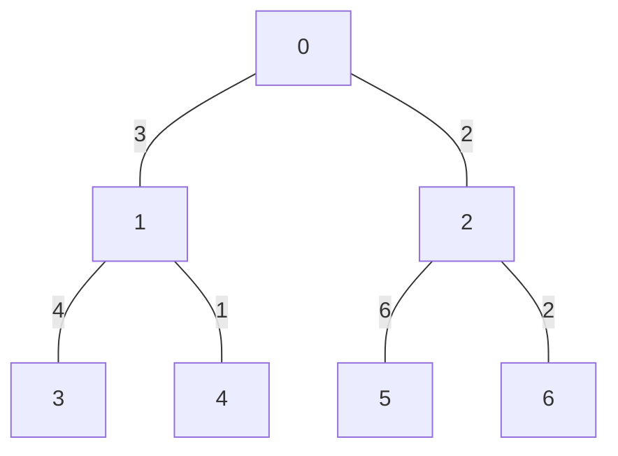

# Tree Diameter：从两次最远点搜索到 XOR 叶剥离

## 题意与一条能手算的直径

输入一棵无向树，每条边有正权。两点距离是它们之间唯一简单路径的边权和。
要求找距离最大的两个点，输出这条路径的总权值、顶点数以及依次经过的顶点。
答案不唯一时任选一条，反向输出同一路径也正确。
`1≤N≤500000`、边权 `1…10^9`，见
[`task.md`](../../../upstream/tree/tree_diameter/task.md)、
[`info.toml`](../../../upstream/tree/tree_diameter/info.toml)。



```text
输入                 一种正确输出
7                    15 5
0 1 3                3 1 0 2 5
0 2 2
1 3 4
1 4 1
2 5 6
2 6 2
```

路径 `3→1→0→2→5` 的边权为 `4+3+2+6=15`，含五个顶点、四条边。
从 1 的分支能向下延伸的最大长度是 4，从 2 的分支是 6，接上它们到根
的边后得到 7 和 8，合起来为 15。路径总权值可能接近 `5×10^14`，
单条边能放进 32 位整数，但累计距离必须用 64 位。
N=1 时没有边，答案是长度 0、顶点数 1、路径 `[0]`。

## 朴素方法：枚举每个起点

固定起点 s，在树上 DFS 一遍，沿边累加距离，得到到其他所有点的距离。
无需 Dijkstra：这里两点只有一条路径，没有多个路线可供取较短者。
对所有 N 个起点各做一次，就能选出全局最远点对，正确但时间 `O(N²)`。
五十万点时需要约两千五百亿量级的访问，重复遍历同一条边太多。

树还满足一个更强的性质：**从任意起点找到的最远点，可以作为某条直径
的端点**。因此只需两次搜索，就能得到直径长度与两端。

## 上游的两次最远点搜索为什么成立

任选初始点 r，把树以 r 为根，记到 r 的加权深度。令 a、b 是某条直径
两端，w 是它们的最近公共祖先，x 是距 r 最远的点。
因为 x 最远，`depth[x]≥depth[a]` 且 `depth[x]≥depth[b]`。

若 x 在 w 子树内，选择与 x 位于 w 不同分支的一端 y；若某端就是 w，
也可选这一端。于是 `LCA(x,y)=w`，另一个端点记为 z：

```text
dist(x,y)=depth[x]+depth[y]-2*depth[w]
         ≥depth[z]+depth[y]-2*depth[w]
         =dist(a,b)
```

若 x 在 w 子树外，则 `LCA(x,a)` 是 w 的祖先，其深度不大于 w；
再利用 `depth[x]≥depth[b]`，同样得到 `dist(x,a)≥dist(a,b)`。
因为 a、b 已经是最长路径，上面的“大于等于”只能取等于，所以 x 也是
某条直径端点。从 x 再找最远点，得到的距离就是直径。
正边权保证深度与沿根路径的远近一致；推广到负权时不能照搬这份论证。

示例从 0 出发，距离数组为 `[0,3,2,7,4,8,4]`，最远点是 5。
从 5 出发，距离变为 `[8,11,6,15,12,0,8]`，最远点是 3，直径为 15。

### 对照 `correct.cpp` 的真实函数与第三次遍历

上游 [`correct.cpp`](../../../upstream/tree/tree_diameter/sol/correct.cpp)
用 `vector<vector<pair<int,long long>>>` 存双向邻接表。
`dfs(g,cur,par)` 返回“从 cur 出发，在排除 par 的方向中最远距离与端点”。
初值是 `(0,cur)`，对子节点递归结果加上边权，再取最大的 pair；
距离相同时用顶点编号打破平局，选出的仍是合法最远点。

`tree_diameter` 先调 `dfs(g,0,-1)` 得 u，再调 `dfs(g,u,-1)` 得 v 和距离。
它没有在第二次搜索时保存所有父指针，所以还调用
`path_restoration(g,path,u,-1,v)` **再走一次 DFS**：进入点就压入 path，
找到目标时把 goal 设为 -1 作为完成标记，没找到则回退并弹出该点。

三次遍历加起来仍是 `O(N)` 时间、`O(N)` 图和路径空间，已经达到读入量
的同阶下界。快解要省的是遍历次数、双向边存储、递归和恢复路径的额外搜索，
而不是把上游的平方时间改成线性。三次递归在长链上深度均可达到 N，
进程栈是这份实现的实际限制；算法可以改用显式遍历序来避免它。

## 另一种线性推导：每点只保留最长的下降方向

任何简单路径以固定根看，都有一个唯一的最高点 v。路径或者只从 v
向一个孩子分支延伸，或者由 v 的两个不同孩子分支拼成。
令 `down[v]` 表示从 v 向已处理子树中走，能取得的最长距离。
处理孩子 u、边权 w 时，新方向长度是 `cur=down[u]+w`。

先用 `cur+down[v]` 更新全局直径，再令 `down[v]=max(down[v],cur)`。
这等价于在每点选择两个最长的不同方向，但无需为每点保存并排序所有方向。
顺序不能反过来：先更新 down[v] 再相加，可能把来自 u 的同一路径用两次。

每个节点的 down 在其所有孩子处理完后才交给父亲，就是普通树形 DP 的
后序不变量。每条路径的最高点都被考虑，因此全局最大候选覆盖真正直径。
直径是两个不同方向相加，这与“从每个点找一个最远点”是不同的求解机制。

## 不存树边，怎样做到这个后序：XOR 叶剥离

### 每点只记三个可删除摘要

对每个点 v 保存 degree、邻居编号异或 `link`、邻边权异或 `weight_xor`。
当 degree=1 时，link 就是唯一剩余邻居，weight_xor 就是那条边权。
异或的抵消律 `x xor x=0` 让删除边只需在邻居摘要中再异或一次，不必
保存或搬动整条邻接表。

开头示例顶点 1 的摘要是：度数 3、邻居 XOR=`0 xor 3 xor 4=7`、
权重 XOR=`3 xor 4 xor 1=6`。删掉边 1–3 后，度数为 2，两个 XOR
分别变为 4 和 2；再删边 1–4 后，度数为 1，摘要变为邻居 0、权重 3，
就可以继续把 1 删向根。

不同边权即使相同也不影响抵消，只要删除时使用那一条实际边的值。
这个结构只支持“当前度数为 1 时取唯一邻居”，不能把 XOR 当成一般邻居枚举器。
树无环、删叶不会错过剩余边，才允许用这种特殊摘要代替完整邻接结构。

### 删除顺序同时完成 DP

固定 0 为保留根。从任意叶子向上连续删除，每删一叶 u，就把
`down[u]+w(u,v)` 合并到剩余邻居 v；v 若也变成叶子，就继续处理。
此时 u 的原子树已经全部折叠到 down[u]，所以删除序正好满足 DP 后序要求。
一趟按顶点编号扫描寻找叶子的外循环就够了：新产生的叶子立即在内循环处理，
不需要从头反复扫描全树。

示例按 3、4、1、5、6、2 的顺序合并：

| 删除 `u→v` | `cur=down[u]+w` | v 原有的 down | 候选直径 | v 新 down |
|---|---:|---:|---:|---:|
| `3→1` | 4 | 0 | 4 | 4 |
| `4→1` | 1 | 4 | 5 | 4 |
| `1→0` | 7 | 0 | 7 | 7 |
| `5→2` | 6 | 0 | 6 | 6 |
| `6→2` | 2 | 6 | 8 | 6 |
| `2→0` | 8 | 7 | 15 | 8 |

最后一次把通向 5 的 8 与通向 3 的 7 拼起来，得到 15。
每条边只删除一次，每点只向父亲合并一次，构造和求直径总计 `O(N)`，
不用两次最远点搜索，也不用递归。

## 当前前五及证据范围

下表来自 [`global.json`](global.json) 的 **2026-09-26 05:12:07 UTC**
不同用户前五快照，均为当时最新版本 AC；源码和哈希见
[`config.json`](../../selected/tree_diameter/config.json)。本题没有归档
`candidate_pool.json`，本文只逐份阅读当前五份，不外推为所有算法族的最快。
五位作者的主算法都是 XOR 叶剥离 DP，并不是五种独立的直径算法。

| 名次 | 提交 / 用户 | 语言 | 时间 | 实际差别 |
|---:|---|---|---:|---|
| 1 | [#361517](https://judge.yosupo.jp/submission/361517) / IceKylin，[源码](../../selected/tree_diameter/361517.cpp) | cpp | 26 ms | 叶剥离回调，显式记录远端、父亲和汇合点 |
| 2 | [#244071](https://judge.yosupo.jp/submission/244071) / nullchilly，[源码](../../selected/tree_diameter/244071.cpp) | cpp | 29 ms | 固定数组、下降指针 f、复用 degree 作输出 |
| 3 | [#243257](https://judge.yosupo.jp/submission/243257) / Anonymous，[源码](../../selected/tree_diameter/243257.cpp) | cpp | 31 ms | 同一 DP，用 vector 和固定内存池 |
| 4 | [#373366](https://judge.yosupo.jp/submission/373366) / brendon4565，[源码](../../selected/tree_diameter/373366.cpp) | cpp | 32 ms | 同一 vector 路线，增加未来 degree 预取 |
| 5 | [#245312](https://judge.yosupo.jp/submission/245312) / Kiffaz11，[源码](../../selected/tree_diameter/245312.cpp) | cpp20 | 33 ms | 固定数组 DP，另一组 Scanner/Printer |

`is_latest=true` 是评测状态，不说明本文重新执行了所有提交，也不能证明
所有合法边界都已覆盖。下文特别记录了 N=1 的源码问题。

### #361517：保存两个真正端点，用父链恢复路径

入口为 `solve_main→XorLinkedTree<true,uint32_t>::build`。除三条图摘要
数组外，`mx[u]` 保存最长下降距离，`pos[u]` 保存该方向真正的远端顶点，
初始 pos[u]=u；`fa[u]` 在 u 删除时设为剩余邻居 v。

当 `mx[u]+w+mx[v]` 改善答案时，保存
`l=pos[u]、r=pos[v]、lca=v`。例如最后一行保留 l=5、r=3、lca=0。
结束后分别沿 fa 从 l、r 走向 lca，输出左半、一次 lca、反向右半，
得到 `[5,2,0,1,3]`。它记录了恢复所需父边，所以无需上游的第三次 DFS。
`pos` 在 DP 结束后复用为临时输出路径；此前仍要用远端信息时不能覆盖。

`build` 给根度数加的是 **1**，不是常见的加 2 永久保留根版本。
根最后也会触发一次回调，但回调第一行 `if(u==0) return` 忽略这次
虚拟处理，真实边的 DP 已完成。l、r、lca 初值都为 0，因此 N=1
仍能恢复 `[0]`。这也是泛化模板时需要保留的配套边界处理。

当前数组随 N 分配，核心为三条 32 位图摘要、64 位 mx、fa 和 pos，
均为线性空间。读取端点用专门的小整数路径，权重用普通无符号解析，
Unix FastIO 默认映射输入。没有在直径 DP 中使用 SIMD 算术。

### #244071：保存“往最优方向的下一步”

这里的 f[v] 不是最远端编号，而是最佳下降方向的**第一个孩子**。
改善 down[v] 时设 `f[v]=u`。更新全局答案时只存 `l=u、r=f[v]`，
它们分别是两条方向的第一步；汇合点可以从删叶时保留下来的 `P[l]` 得到。

路径恢复先写汇合点，然后从 l 沿 f 一直走到其末端，再从 r 沿 f
走到另一末端，输出时把第一段反转。f=0 表示没有后续孩子；由于固定根
0 从来不是谁的下降孩子，这个哨兵与真实下降顶点不冲突。
示例最后 l=2、r=1、P[l]=0，向下分别得到 `2→5` 和 `1→3`，组合为
`5→2→0→1→3`。一条父链加多个端点数组被较短的下降指针替代。

deg、P、W、f、mx 是容量 `2^19` 的静态数组，根度数置 0 以阻止删除。
DP 后 deg 不再需要，复用为路径数组。源码还覆盖 operator new 使用
12 MiB 的单调分配缓冲，但核心图数组本来就是静态数组，不能把池分配
说成省去了每条树边的 malloc。`cin/cout` 宏实际指向自定义 IO。

### #243257：同一路径指针，按实际 N 分配

更新和恢复公式与上一份相同，但 deg、P、W、f、mx 换成 vector，
分配由 12 MiB 内存池承接，delete 不回收。单次处理一棵树、容量有界，
才符合这个内存池的用途；不能直接当作可以无限重复建树的容器。
根用 `deg[0]+=2` 保留，因此整个剥离中根度数始终大于等于 2。
时间和空间仍 `O(N)`，不是换用了一种新的直径算法。

### #373366：预取未来扫描项，核心仍是相同 DP

同样使用 vector、根度数加 2、f 下降指针和 degree 输出复用。
可见工程差别包括内存池扩大为 50 MiB，外层每步
`__builtin_prefetch(&deg[i+30])` 提前提示后续度数地址。
它尝试在计算当前叶链时让未来缓存行更早到达，但不能提前知道叶链跳到
哪个随机父亲；额外预取也可能没有收益。移植时应对尾部地址加边界或填充，
不能因为预取指令通常不触发异常就忽略 C++ 地址有效性。
文件的 AVX2/BMI 等编译目标并不等于这个标量 DP 在并行处理多条边。

### #245312：静态数组与另一组缓冲读写

`solve` 使用容量 `2^19` 的五条数组，根度数置 0，合并与 f 恢复流程和
#244071 一样。读写入口是 `sc.read`、`pr.write/writeln`，按文件描述符
批量读写、查表格式化整数；大量其他模板和宏没有成为直径主算法。
同族代码在 29…33 ms 间的差异同时包含 I/O、内存布局和计时波动。

### N=1 的实际源码边界不能略过

#244071、#243257、#373366、#245312 都声明了未初始化的局部 `int l,r`，
仅在找到严格更长的正路径时赋值。N=1 时没有边，也没有任何这样的更新，
随后路径恢复读取 `P[l]` 和 r，属于未初始化读取。当前 AC 快照不使它
成为有定义的 C++ 行为；即使某次编译碰巧输出正确，也不能作为可复用保证。
通用实现应显式返回 `0 1` 和顶点 0，或像 #361517 一样初始化完整状态。
此处结论来自可直接检查的控制流，不声称本篇已经向 OJ 提交反例。

## 本仓库如何吸收，以及该怎样验证

本地 [`xor_leaf_peeling.cpp`](../../../problems/tree/tree_diameter/xor_leaf_peeling.cpp)
与 [`bottom_up_dp.cpp`](../../../problems/tree/tree_diameter/bottom_up_dp.cpp)
分别保留 XOR 压缩图和显式定根后的逆序 DP，说明见
[`tutorial.md`](../../../problems/tree/tree_diameter/tutorial.md)。后者同样只
合并各点最长下降方向，便于在完整邻接表仍有其他用途时复用。
精选配置还保留 #278238、#275649 的旧个人记录，`is_latest=null`，
本篇没有把它们的旧成绩当作当前前五或当前性能对照。

验证不仅比较长度，还要检查输出相邻点确有边、没有重复顶点、边权和等于
报告值、顶点数正确。小树可枚举所有起点作参照；重点覆盖 N=1、两点、
长链、星形、相等权值、多个等长直径以及总权值超过 32 位的树。

若进行同机实验，应分别固定 I/O 后比较三次递归遍历、两遍并保存父亲、
显式后序 DP、XOR 叶剥离，再对比端点父链与 f 下降指针的恢复开销。
本地 tutorial 中的总耗时比属于历史 benchmark；本篇只复核缓存、源码
和手算过程，没有新的 OJ 请求或性能实验。
