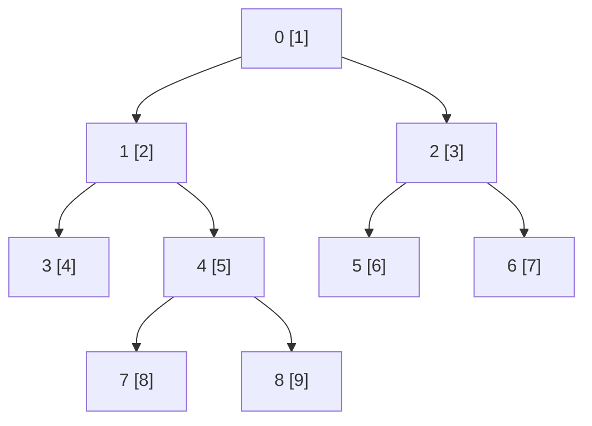

# Vertex Add Path Sum：从重链区间和到根路径和的差分

## 题意与一组完整操作

给一棵无向树，每点 v 有权值 a[v]。`0 p x` 把 a[p] 加 x，
`1 u v` 查询 u 到 v 的唯一简单路径上所有**顶点**的权值和，包含两端。
`N,Q≤500000`，初值与增量在 `[0,10^9]`。输入是任意编号的无向边，
没有父编号小于孩子的约束。见
[`task.md`](../../../upstream/tree/vertex_add_path_sum/task.md)、
[`info.toml`](../../../upstream/tree/vertex_add_path_sum/info.toml)。

以 0 为根解释这棵树，点 v 的初值为 v+1：



```text
输入                         输出
9 8                          20
1 2 3 4 5 6 7 8 9            26
0 1                          30
0 2                          15
1 3                          41
1 4                          30
2 5
2 6
4 7
4 8
1 3 8
1 7 6
0 4 10
1 3 8
1 4 4
0 0 5
1 7 6
1 3 8
```

`3→8` 为 `[3,1,4,8]`，初始和 `4+2+5+9=20`；`7→6` 为
`[7,4,1,0,2,6]`，初始和为 26。点 4 加 10 后，这两条路径各增加 10，
同点查询 4→4 返回 15。随后根 0 加 5，7→6 变为 41，3→8 没经过根，
仍为 30。这个最后的区别会检验根路径公式中的抵消是否正确。
所有更新累计后总权值可接近 `10^15`，必须用 64 位保存和。

## 朴素解法为什么不够

可以先求每点父亲和深度。查询时让深点逐边上移、再让两点同时上移，
把经过的值相加，最后只加一次相遇点；修改只改一个 a[p]。
树上路径唯一，所以这个过程覆盖恰好需要的点。问题是链树中一次查询
可能走 N 个点，最坏 `O(NQ)`，约 `2.5×10^11` 次访问。

静态时可以保存根到每点的和，但一次修改会影响许多后代，不能简单保持
原数组不变。上游先采用较通用的“把路径拆成少量连续段”；公开前三名
则进一步利用加法的可逆性，只维护根路径和。

## 上游 `correct.cpp`：重链剖分加 Fenwick

上游 [`correct.cpp`](../../../upstream/tree/vertex_add_path_sum/sol/correct.cpp)
用双向邻接表建树，`get_hl(g,0)` 调两次递归：第一趟求子树大小，
每点选最大孩子作为重孩子；第二趟优先访问重孩子，使每条重链在编号
ord 中连续。其他孩子边为轻边，每跨一条轻边子树规模至少减半，
所以一条根路径只有 `O(log N)` 段重链。

### 一条路径怎样变成连续数组段

采用平手时较小孩子优先的一种合法剖分，示例重链是
`0→1→4→7`、`8`、`3`、`2→5`、`6`，对应数组顺序
`[0,1,4,7,8,3,2,5,6]`，值为 `[1,2,5,8,9,4,3,6,7]`。
每条链上，位置顺序与祖先深度顺序相同；跨链时一次跳到链头的父亲。
源码的平手处理可能产生另一种有效次序，不影响查询。

上游的 small[位置] 是链头位置，big[位置] 是链头父亲的位置，
`_ord/_rord` 在顶点与剖分位置之间转换。`lca(u,v)` 利用这些量跳过
链，得到最近公共祖先 c。随后 `main` 从 `a[c]` 开始，分别调用
`get_path(c,u)` 和 `get_path(c,v)`，这两个函数给出的段**不包含 c**。

示例 `3→8` 的 c=1：先加 a[1]=2；1 到 3 的部分给出单点 3，值 4；
1 到 8 的部分给出单点链 8，值 9，再给出同根重链中的点 4，值 5。
总计 `2+4+9+5=20`，每个点只计一次。函数回调参数为闭区间 `[l,r]`，
传给 Fenwick 时转成半开 `[l,r+1)`，不能漏掉最后一点。

### 每段如何求和，实际复杂度是多少

Fenwick 的一基槽 j 保存最后 `lowbit(j)=j&(-j)` 项的和。
前缀查询反复 `j-=lowbit(j)`，修改反复 `j+=lowbit(j)`，均为
`O(log N)`；区间和是两个前缀之差。比如上述重链数组的 `[2,4)`
对应点 4、7，和为 5+8=13，Fenwick 返回 `prefix(4)-prefix(2)`。

每问有 `O(log N)` 个重链段，每段又要 `O(log N)` 求和，所以路径查询
最坏是 **O(log²N)**；不能只因 HLD 跳链是对数次就省略第二层对数。
单点更新为 `O(log N)`，初始化上游逐点 fw.add，为 `O(N log N)`，
总体空间 `O(N)`。

这份 HL 构造器还调用 `init_extra` 生成深度、链编号、链长度、子树右端，
虽然本题后续主查询不使用其中全部信息，构造时确实执行了这些线性扫描。
DFS 则在极深链上依赖递归栈。公开快解有的减少这些通用预处理，有的
彻底改变所维护的和，下面分别看。

## 用加法消去大部分路径：三个根路径和就够了

定义 `F(v)=从根到 v 的顶点权值和`，包括根和 v。若 c=LCA(u,v)，
两条根路径共有根到 c 的整段；在 F(u)+F(v) 中它被算了两遍。
把 F(c) 减两次，再补回路径确实应包含的一次 a[c]，得到

```text
path_sum(u,v) = F(u)+F(v)-2*F(c)+a[c]
```

示例 u=3、v=8、c=1，初始 F(3)=7、F(8)=17、F(1)=3，
所以 `7+17-2*3+2=20`。根加 5 后，三个 F 都增加 5；
`5+5-2*5=0`，因为 c=1 的权值没变，答案仍为 20（再考虑点 4 的
先前增量则为 30）。若 c 就是根，最后 a[c] 会增加 5，正确保留一次根贡献。

求最大值不能这样用减法抵消，这项归约依赖本题维护的是可加可减的和。
它把 `O(log N)` 个路径区间查询，变成固定三个根路径值查询和一次 LCA。

## 点增量怎样变成子树区间增量

修改 a[x] 加 delta 时，哪些 F(v) 会改变？恰好是根路径经过 x 的点，
也就是 x 的所有后代，含自身。因此在普通 DFS 先序里，这些 F 值占据
一个连续区间 `[tin[x],tout[x])`，要做的是**区间加、单点查**。

为便于对应源码，使用一基 DFS 位置。按孩子编号递增遍历，示例为：

| 位置 | 1 | 2 | 3 | 4 | 5 | 6 | 7 | 8 | 9 |
|---|---:|---:|---:|---:|---:|---:|---:|---:|---:|
| 顶点 | 0 | 1 | 3 | 4 | 7 | 8 | 2 | 5 | 6 |
| 原权值 | 1 | 2 | 4 | 5 | 8 | 9 | 3 | 6 | 7 |
| F 值 | 1 | 3 | 7 | 8 | 16 | 17 | 4 | 10 | 11 |

点 4 的子树是 `[4,7)`，增加 10 后，位置 4、5、6 的 F 分别变成
18、26、27，其余位置不变。不能把它误写成只更新 F(4)。

### 用差分把区间加改成两个单点加

令 `D[i]=F[i]-F[i-1]`，F[0]=0，则 F[i] 是 D 的前缀和。
给 `[l,r)` 中所有 F 加 delta，只会改变两个差分：

```text
D[l] += delta
D[r] -= delta
```

示例 F 对应 D 为 `[1,2,4,1,8,1,-13,6,1]`。
更新点 4 时只改 `D[4]:1→11`、`D[7]:-13→-23`；前缀求到位置 6
时已收到 +10，求到位置 7 时 -10 抵消，所以只有目标子树内的 F 改变。

现在 Fenwick 保存的是 **D 的区间摘要**，其一次前缀查询返回单个 F 值，
不是求若干 F 的总和。一次点权修改对应两次 Fenwick add，再把单独保存
的 a[x] 加 delta；路径查询做三次前缀和。动态部分每问 `O(log N)`。
如果 r=N+1，把退出增量写到一个永远不作为顶点查询的哨兵位置即可。

## LCA 也可只用短父序列的 RMQ

这里原编号无序，不能直接取父**编号**的最小值。但 DFS 位置天然满足
祖先位置小于后代，所以在非根位置 i 存“该点父亲的 DFS 位置”
`E[i]=tin[parent[vertex_at_i]]`，便有：

```text
若 l=min(tin[u],tin[v]) < r=max(tin[u],tin[v])，
tin[LCA(u,v)] = min(E[l+1..r])
```

两位置之间还没离开 LCA 子树，其进入边的父端不会比 LCA 更早；而进入
后一分支时恰有一条边来自 LCA，所以这个最小值一定被取到。
必须排除 E[l]，它是进入较早端点的边，可能来自答案的上方。
示例 E 的位置 2…9 为 `[1,2,2,4,4,1,7,7]`；3、8 的位置为 3、6，
查询 E[4..6]=[2,4,4]，得到答案位置 2，即顶点 1。

前三份源码对 E 每 64 项分块，存块前缀/后缀，仅给整块最小值建稀疏表；
同块直接扫至多 64 项，跨块用两端摘要和两个可重叠的整块表项。
重叠安全因为 `min(x,x)=x`，细节见
[`Static RMQ 教程`](../staticrmq/analysis.md)。返回值已经是 DFS 位置，
随后直接索引该位置的权值和 Fenwick，无需再转回原顶点编号。

设 M≈N/64，预处理 `O(N+M log M)`、空间同阶；每次修改 `O(log N)`，
查询为 `O(log N+64)` 的最坏界，固定块长下是 `O(log N)`。
相对于上游，真正消掉的是每条重链各做一次区间和产生的第二个对数。

## 当前前五和范围

以下来自 [`global.json`](global.json) 的 **2026-09-26 04:19:07 UTC**
不同用户前五，均为当时最新版本 AC；源码与哈希见
[`config.json`](../../selected/vertex_add_path_sum/config.json)。
本题没有归档 `candidate_pool.json`，本篇只审阅当前五份，不据此宣称
全站同族最快或其他算法不存在。个人旧提交仍在配置中，其旧状态与时间
不混入本表。最新版本标志也不等于本文实际重测了每个 ID。

| 名次 | 提交 / 用户 | 语言 | 时间 | 实际主路线 |
|---:|---|---|---:|---|
| 1 | [#278241](https://judge.yosupo.jp/submission/278241) / chaihf，[源码](../../selected/vertex_add_path_sum/278241.cpp) | cpp | 100 ms | 非递归 DFS；父位置 RMQ；差分 Fenwick 根路径和 |
| 2 | [#405050](https://judge.yosupo.jp/submission/405050) / Rohan_Kapri，[源码](../../selected/vertex_add_path_sum/405050.cpp) | cpp | 108 ms | 与第一份规范化行尾后相同 |
| 3 | [#269677](https://judge.yosupo.jp/submission/269677) / Anonymous，[源码](../../selected/vertex_add_path_sum/269677.cpp) | cpp | 108 ms | 同一归约；递归 DFS；祖先端点查询少算一个前缀 |
| 4 | [#255076](https://judge.yosupo.jp/submission/255076) / mukundan314，[源码](../../selected/vertex_add_path_sum/255076.cpp) | cpp | 116 ms | XOR 定根 HLD；16叉前缀槽；线性建表 |
| 5 | [#243452](https://judge.yosupo.jp/submission/243452) / nor，[源码](../../selected/vertex_add_path_sum/243452.cpp) | cpp20 | 127 ms | XOR 定根 HLD；8叉前缀槽；逐点建表 |

## #278241 / #405050：按阶段生成差分与静态索引

两份执行代码相同。读入边后用固定数组前向星保存邻接关系，DFS 不递归：
head[u] 兼作当前点尚未处理的邻边游标，走入孩子时记录 p[child]=u，
邻边处理完后沿 p[u] 返回。相当于把递归帧中的游标保存在 head 中，
父亲数组负责返回，省掉进程栈；代价是 head 被消耗，不能再按原入口遍历图。

进入 u 时设一基位置 l[u]，把 a[u] 加入 c[l[u]]；离开其子树时令
r[u]=当前计数+1，并在 c[r[u]] 减 a[u]。这些正负事件相加后，c 正好
就是上文的 D。源码接着先把 c 求前缀，得到 F；再逆序做
`c[i]-=c[i-lowbit(i)]`，把 F 的前缀差变回 D 的 Fenwick 摘要。
这两趟线性构造不是“把 F 当原数组插入 Fenwick”，后者查询会多求一次和。

b[l[u]] 另存点 u 的当前自身权值，供公式中的 a[c] 和同点查询使用。
更新只改 b 的一个槽、c 的进入与退出两个 Fenwick 路径；不会修改静态
LCA RMQ，因为树拓扑没有变化。查询 u=v 时直接返回 b[u]，避免空 RMQ。
其他查询先得 LCA 位置 w，再执行
`b[w]+prefix(u)+prefix(v)-2*prefix(w)`。

RMQ 的变量 `suf` 实际正向构造块前缀，`pre` 反向构造块后缀，读代码
应以循环方向为准。缓存稿中的 `val[0]`、根占位等没有完整初始化，建表
循环也会碰到无效尾项；有效数学查询排除这些位置，并不等于所有 C++
读操作都有定义。迁移时应初始化占位与填充，或仅构造有效表项，再保留
同样的查询边界，不能把算法证明直接当成未初始化读取的证明。

权值、差分摘要和答案累加器使用 u64。差分可以为负，在存储中用模
`2^64` 表示，加减仍会抵消；最终真实路径和非负且小于 `2^64`，所以
输出正确。一般有符号权值场景则需要重新设计表示与输出。
输入输出用映射文件、小整数解析和缓冲写入，RMQ 局部数组使用 GCC
可变长栈数组；这一非标准扩展与其栈空间仍是移植条件。

## #269677：祖先端点使三个前缀变成两个

它的 dfs 用递归填写同样的 l、r、p、b、c，后续线性 Fenwick 构造和
64 元素块 RMQ 相同。主要查询差别是判断较早 DFS 端点是否等于 LCA。
如果 w=u，根路径公式化简为 `F(v)-F(u)+a[u]`，只需两个前缀查询。
例如从 1 到 8，初始值 `17-3+2=16`，无需再次计算并减两倍 F(1)。
普通跨分支查询仍需三次前缀。

此优化针对祖先后代查询比例，对平衡树上的随机两端点未必经常命中。
递归 DFS 在长链上仍依赖栈容量，而前两份用破坏邻接游标的迭代实现。
不能仅按它们都调用了 Fenwick 就忽略这两个实际差异。

## #255076 / #243452：保留 HLD，换成宽分支前缀结构

### XOR 定根怎样得到重链

两份每点只存度数与邻居 XOR，不保存双向邻接表。当前叶子的 XOR 就是
唯一剩余邻居；删除叶子时记录父亲、累加子树大小，并为父亲保留最大孩子。
固定根 0 不参与删除，反向叶删除序是父亲优先序。
随后从尚未编号的点出发，沿 heavy_child 一直排完一条重链。
degree 数组复用为链头编号，subtree_size 复用为位置，neighbor_xor
在节点删除后保留其父亲。各数组只在旧含义不再需要时才覆盖。

这里仅需每条重链连续、父链先于孩子链编号，不要求整个排列也作为查询
子树的 DFS 区间。求路径和时比较链头位置，先加较后一条链的整段，
跳到其链头父亲；链头相同时合并剩余同链区间，直接包括双方端点。
与上游相比，它没有先单独求 LCA、再从两端分别调用 get_path，最终
同链区间自然只含一次 LCA。

### 宽前缀槽的一层如何工作

教学取扇出 B=4，一组孩子总和为 `[5,7,2,6]`，保存排他前缀
`[0,5,12,14]`。孩子 1 增加 3，槽号大于 1 的位置都加 3，变成
`[0,5,15,17]`。想要前两个孩子的和，直接读槽 2=15，不再逐个相加。
更上层以同样方式保存完整子块的前缀，查询沿层级取一个槽并相加即可。

一层的更新会改多个连续前缀槽。源码用 256 位向量放四个 64 位数，
delta 广播四份，预计算 mask 的槽为全 0 或全 1，按 `slot>更新槽`
选择应该增加的位置。每层 B/4 组向量相加；查询每层只读一个整数。
相对于二叉/Fenwick，它降低了层数和查询时的随机读取，但增加更新写入。
正确性不依赖 SIMD，SIMD 只是一次执行四个独立加法；运行则需要目标
编译器和 CPU 支持这些指令。

### #255076 的线性 SIMD 建表

扇出为 16，原值先写入最低层位置 id+1，`s.build()` 一次性建立局部
前缀与上层摘要。`prefix_x2` 用 AVX2 在两个 128 位半区各做一对前缀，
再由 `update` 携带前组的总和逐对传播。例如四槽 `[2,5,1,4]` 先变为
`[2,7,1,5]`，把前两槽总和 7 传给后两槽后得到 `[2,7,8,12]`。
对每个 16 项块这样生成前缀，再把末项与边界原值组成完整块和，写入上层。
额外填充和 `exchange(边界槽,0)` 用来让下一块重新从空前缀开始。

这与子树题 #306174 “只在底层保存完整初始前缀”的变体不同；这里确实
逐层构造局部前缀。总单元数为几何级数，初始化 `O(N)`，相对下一份
消除了 N 次完整动态更新。源码头部也说明以 #243452 为基础修改建表。

HLD 有 `O(log N)` 段，每个段做两次 `O(log_16 N)` 前缀查询，
所以路径查询 `O(log N*log_16 N)`，固定扇出时仍是二重对数路线；
更新每层写 16 个槽，标量工作 `O(16 log_16 N)`，或四槽指令约四组每层。
不要因为一次前缀很短就把整个路径查询写成常数。

### #243452 的8叉结构与逐点初始化

同样的 XOR 重链构造，动态结构扇出是 8，容量按 `1<<20` 固定配置。
sum(k) 先把 k 加一，表示闭前缀，因此闭区间查询为
`sum(r)-sum(l-1)`；#255076 的 sum 是半开前缀，对应 `sum(r+1)-sum(l)`。
这些端点差异不改变算法，但照搬接口时很容易少算一个点。

构造每条重链时直接对每个初始值调用 update，建表是
`O(N*8*log_8 N)` 的标量槽工作。更新每层两组四槽向量，比 16 叉单层
少写，但树更高，查询读的层数也更多。两份都以固定数组和宏替换的自定义
IO 执行，不是标准 cin/cout；本次快照不能单独把 116 与 127 ms 的差距
全归因于线性建表，因为扇出、布局和读写也不同。

## 怎样选择与核验

| 路线 | 初始化 | 修改 | 路径查询 | 关键代价 |
|---|---|---|---|---|
| 上游 HLD + Fenwick | `O(N log N)` | `O(log N)` | `O(log² N)` | 通用拆路径，递归构造和多段求和 |
| 根路径差分 + 块 RMQ | `O(N+(N/64)log(N/64))` | `O(log N)` | `O(log N+64)` | 依赖和可做减法，另建静态 LCA 索引 |
| HLD + 宽前缀槽 | 线性或逐点更新，依源码而定 | `O(B log_B N)` 槽 | `O(log N log_B N)` | 更宽的更新写入、SIMD 与固定扇出 |

小规模用朴素恢复路径逐点相加作参照，覆盖同点、祖先后代、跨根分支、
根更新、叶更新、重复更新和更新 0。根更新后，不经过根的路径和应保持
不变，正是本篇例子最后一问验证的抵消性质。再覆盖 N=1、长链、星形、
64 项 RMQ 边界和超过 32 位的累加结果。

本题当前没有单独的本地 problems/tutorial；可对照
[`Jump on Tree`](../jump_on_tree/analysis.md) 的 HLD 与 XOR 定根，及
[`Vertex Add Subtree Sum`](../vertex_add_subtree_sum/analysis.md) 的 Fenwick
和两种宽树表示。性能实验应固定 I/O 后分别替换路径归约、LCA、动态索引、
初始化方式，再区分同点/祖先/跨分支查询。本篇没有访问 OJ 或新增性能
benchmark，保留当前快照而不为毫秒差给出未经测量的原因。
