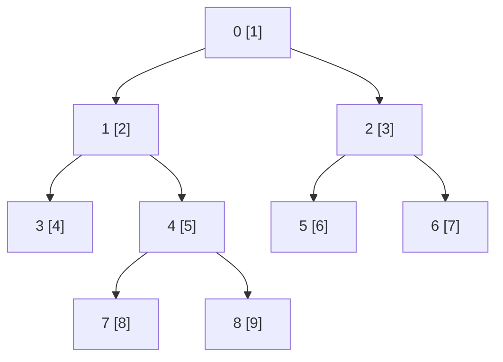

# Vertex Add Subtree Sum：把子树变成区间，再减少求和开销

## 题意与完整小例子

根为 0，每点 v 有权值 a[v]，输入给出每个非根点的父亲 p[v]。
`0 u x` 把 a[u] 加 x；`1 u` 查询 u 的整个子树的权值和，包含 u 自身。
`N,Q≤500000`、`0≤a[v],x≤10^9`，并保证 **p[v]<v**。
见 [`task.md`](../../../upstream/tree/vertex_add_subtree_sum/task.md) 和
[`info.toml`](../../../upstream/tree/vertex_add_subtree_sum/info.toml)。

采用父数组 `[0,0,1,1,2,2,4,4]`，即下面这棵 9 点树；方括号内为权值：



```text
输入                       输出
9 6                        28
1 2 3 4 5 6 7 8 9          38
0 0 1 1 2 2 4 4            32
1 1                        55
0 4 10                     4
1 1
1 4
1 0
1 3
```

子树 1 初始包含点 `1,3,4,7,8`，和为 `2+4+5+8+9=28`。
把点 4 加 10 后，它变成 15，所以子树 1 为 38，子树 4 为
`15+8+9=32`，全树从 45 变成 55，叶子 3 仍为 4。
总和可能达到初始值总和加全部更新，即约 `10^15`，必须使用 64 位。

## 朴素维护的两种瓶颈

只保存各点权值，修改为 `O(1)`，查询时遍历整个子树相加，单问最坏
`O(N)`。若每次都查根，五十万问可能接近 `2.5×10^11` 次点访问。
反过来提前保存每个子树和，查询可 `O(1)`，但更新一个点时必须修改它
的所有祖先，链树上又会变成 `O(N)`。需要一种让更新与查询都只影响
少量摘要的表示。

## DFS 先序为什么能把子树压成连续区间

DFS 是进入一个点后，完整走完一个孩子子树，再走下一个孩子子树。
记录每点第一次进入时的位置 tin[v]，离开整棵子树时记录计数器 tout[v]。
中途不会插入该子树外的点，所以其所有点恰好占据半开区间
`[tin[v],tout[v])`，区间长度就是子树大小。

按孩子编号递增访问，示例得到：

| DFS 位置 | 0 | 1 | 2 | 3 | 4 | 5 | 6 | 7 | 8 |
|---|---:|---:|---:|---:|---:|---:|---:|---:|---:|
| 顶点 | 0 | 1 | 3 | 4 | 7 | 8 | 2 | 5 | 6 |
| 权值 B | 1 | 2 | 4 | 5 | 8 | 9 | 3 | 6 | 7 |

子树 1 是 `[1,6)`，子树 4 是 `[3,6)`，子树 2 是 `[6,9)`。
原点编号的连续区间不具有这个性质，比如 1 的子树并不是编号 1 到 8。
现在更新只需改 `B[tin[u]]`，查询变成一段数组和。

## 上游实际算法：DFS 序加 Fenwick 树

上游 [`correct.cpp`](../../../upstream/tree/vertex_add_subtree_sum/sol/correct.cpp)
先用孩子邻接表 `g[p].push_back(v)` 存树，递归 `dfs(0)` 填
`lord=tin、rord=tout`，然后把 a[v] 加入 Fenwick 的 lord[v] 位置。
每次修改调用 `fw.add(lord[u],x)`，查询调用
`fw.sum(lord[u],rord[u])`。

### Fenwick 摘要存的到底是哪一段

Fenwick 内部使用一基下标。`lowbit(j)=j&(-j)` 是 j 的最低一个 1
所代表的二进制幂；槽 `seg[j]` 保存最后 lowbit(j) 个元素的和，即
一基区间 `[j-lowbit(j)+1,j]`。例如 6 的二进制为 110，lowbit=2，
槽 6 管第 5、6 项；槽 4 管第 1…4 项。

前缀 `[0,k)` 可以不断读取 seg[k]，再令 `k-=lowbit(k)`。这些区间
首尾相接、互不重叠，直到 k=0 刚好覆盖目标前缀。
修改零基位置 i 时，从 j=i+1 开始，反复令 `j+=lowbit(j)`，把所有
包含该项的摘要加 x。每步消去或推进一个二进制层级，均为 `O(log N)`。

示例 B 建好后，一基 Fenwick 槽为
`[1,3,4,12,8,17,3,38,7]`。查询子树 1：

```text
prefix(6) = seg[6]+seg[4] = 17+12 = 29
prefix(1) = seg[1] = 1
sum[1,6) = 29-1 = 28
```

点 4 位于零基位置 3，增加 10 时更新一基槽 4、8：二者变成 22、48。
新 prefix(6)=17+22=39，子树 1 为 39-1=38；子树 4 则减去
prefix(3)=seg[3]+seg[2]=4+3=7，得到 39-7=32。

上游 N 次 `fw.add` 初始化为 `O(N log N)`，DFS 为 `O(N)`，
每次操作 `O(log N)`，图、DFS 区间和 Fenwick 均为 `O(N)` 空间。
递归 DFS 在链树上深度可达 N，这是实现的栈条件，并非这个归约必须依赖递归。
下面的优化分别针对建序、初始化和动态摘要本身，不能混称为一个新算法。

## 利用父编号约束，不建邻接表就能分配 DFS 区间

先令 size[v]=1，按 v=N-1…1 逆序累加 `size[p[v]]+=size[v]`。
因为父编号更小，处理 v 时其后代已经处理完成。再从小到大分配位置：

```text
tin[0]=0, cursor[0]=1
for v=1..N-1:
    tin[v]=cursor[p[v]]
    cursor[p[v]]+=size[v]
    cursor[v]=tin[v]+1
    tout[v]=tin[v]+size[v]
```

cursor[p] 表示父子树内尚未分配部分的开头。示例 size[1]=5、size[2]=3：
先给子树 1 留 `[1,6)`，根 cursor 移到 6，再给子树 2 留 `[6,9)`。
分配点 3 时，点 1 的 cursor 为 2，留一个位置；再给点 4 留 `[3,6)`。
每次按完整子树长度切片，归纳可知所有区间连续、互不重叠，并且恰好填满。
只需两趟 `O(N)` 扫描，无邻接表、无 DFS 栈。

另一些源码从区间右端向左切，得到反向孩子顺序。只要最终保持连续子树，
求和结果完全相同。这个捷径依赖 `p[v]<v`；任意编号树应先求父亲优先序，
不能直接按原顶点编号套上述循环。

## 当前前五与审阅范围

[`global.json`](global.json) 的 **2026-09-26 04:19:09 UTC** 快照按
不同用户取前五，以下均为当时最新版本 AC，语言字段均为 `cpp`。
源码和哈希见 [`config.json`](../../selected/vertex_add_subtree_sum/config.json)。
没有归档的 `candidate_pool.json`，本文只逐份阅读当前五份，未完成
更深排名的算法族搜索。最新测试版本状态不等于本文对每份主动发起了重测。

| 名次 | 提交 / 用户 | 时间 | 实际路线 |
|---:|---|---:|---|
| 1 | [#403571](https://judge.yosupo.jp/submission/403571) / nandhagk，[源码](../../selected/vertex_add_subtree_sum/403571.cpp) | 34 ms | 编号建序；普通块和层级，叶宽16/上层宽32；链特化 |
| 2 | [#405058](https://judge.yosupo.jp/submission/405058) / Rohan_Kapri，[源码](../../selected/vertex_add_subtree_sum/405058.cpp) | 35 ms | 相同配置与主路径 |
| 3 | [#306174](https://judge.yosupo.jp/submission/306174) / mukundan314，[源码](../../selected/vertex_add_subtree_sum/306174.cpp) | 35 ms | 编号建序；16叉前缀摘要，初始全局前缀加动态增量 |
| 4 | [#278243](https://judge.yosupo.jp/submission/278243) / chaihf，[源码](../../selected/vertex_add_subtree_sum/278243.cpp) | 37 ms | 编号建序；线性初始化 Fenwick |
| 5 | [#244055](https://judge.yosupo.jp/submission/244055) / nullchilly，[源码](../../selected/vertex_add_subtree_sum/244055.cpp) | 52 ms | 编号建序；8叉前缀摘要，逐点初始化 |

## #278243：先保留 Fenwick，删掉多余的初始化工作

这份 `main` 正是较容易吸收的一步：不换动态结构，先去掉邻接表和递归。
l 最初存子树大小，逆序累加后根记为 N；正序从父亲剩余区间的右端给
每个孩子分配整段。未处理的 p[v] 仍是原父亲，处理后改存该点子树右端；
l[v] 在其孩子逐个切走尾段后，最终停在自己的一基 DFS 位置。

示例最终的 l 为 `[1,5,2,9,6,4,3,8,7]`，p 改为
`[9,9,4,9,8,4,3,8,7]`。子树 1 是闭区间 `[5,9]`，权值仍为 28。
原数组被映射到一基 b 后，先正向求完整前缀和 P，再反向做
`b[i]=P[i]-P[i-lowbit(i)]`。右边两个前缀值在反向遍历时都尚未被覆盖，
得到的正是 Fenwick 槽应存的区间和。

这把上游 N 次动态 add 的 `O(N log N)` 初始化变成 `O(N)`，查询与更新
仍 `O(log N)`，核心数组也更少。查询从右前缀减左前缀，b 与累加器使用
u64；中间减法可以模 `2^64` 回绕，最终数学答案非负且小于 `2^64`，
加减抵消后仍得到正确结果。不能照此推断带任意负权时也可直接无符号输出。
读取与输出是手写映射 I/O、分块十进制解析和缓冲格式化。

## 两种“宽分支求和”必须区别讲

二叉线段树每层分两份，宽分支结构改成每层分 B 份，树高约为
`log_B N`。但一个节点存什么会直接改变代价：

| 一个节点的槽含义 | 修改一个位置 | 查询一个前缀 |
|---|---|---|
| 每槽只存对应孩子的总和 | 每层改一个槽 | 每层要加若干个此前的兄弟槽 |
| 每槽存此前所有孩子的前缀和 | 每层要改该位置之后的多个槽 | 每层只读一个前缀槽 |

前者把工作留给查询，后者把工作提前放到更新。下面榜首与第三、第五名
恰好采用这两种不同表示，不能看到 WideSegmentTree 就当作同一个内核。

### 普通块和：跨块查询如何剥去边缘

教学取叶宽 4。B 数组 `[1,2,4,5 | 8,9,3,6 | 7]` 的块和为
`[12,26,7]`。查询 `[2,8)`：先加左端未对齐的 `4+5`，剩下完整块
`[4,8)`，直接读块和 26，得到 35。若整块还很多，就继续用上一层
更大块的总和，中间完全覆盖的部分不再逐项访问。

修改位置 3 加 10 时，只改原值 5→15、第一个块和 12→22，再改更上层
包含它的一个块和。每层一个槽，更新 `O(log_B N)`；一般区间边缘每层
最多处理 `O(B)` 个槽，查询 `O(B log_B N)`，固定 B 后是较矮的层级。
存储按每层缩小 B 倍的几何级数求和，整体仍 `O(N)`。

### 前缀槽：为什么更新改“当前位置后面的槽”

设一个 4 叉节点的孩子总和为 `[5,7,2,6]`，存排他的前缀
`[0,5,12,14]`；全块和由上层承接。孩子 1 增加 3，只需把槽 2、3
分别加 3，变为 `[0,5,15,17]`。查询取前两个孩子时直接读槽 2=15。
每层要修改“槽号大于被改孩子号”的后缀，这就是源码掩码 `i>k` 的来源。

AVX2 一组有四个 64 位槽。把 delta 广播到四槽，掩码槽取全 0 或全 1，
`delta & mask` 得到应该加的量，再向量相加；块宽 16 时每层做四组。
这并没有减少需要修改的前缀值个数，只是一次指令处理四个连续值。
查询则在每层读一个与 k 的 B 进制前缀对应的槽，把它们加起来。
不同层贡献的区间互不相交，拼成所需前缀。

## #403571 / #405058：原值块和、链分支与操作打包

一般树主路径的配置是
`configuration<32,500000,tiered_sum<16>,avx2>`：第 0 层存原值，
第 1 层每 16 项存总和，更高层每 32 项再存总和。
实际匹配的是 `tiered_sum` 专门实现，不是文件前面那些带懒标记的通用模板。
`accumulate` 每层改一个计数，并维护 total；`fold` 逐层剥去两端未
对齐的部分，中间完整范围再上升。一般边缘 while 是标量循环，
`sum_slots` 在建表、前缀或顶部规约中才四路 AVX2 求和，不能笼统说
“每次区间查询全程 SIMD”。

建序采用前面的“逆序大小、正序 cursor 切片”。meta[v] 起先用低 32 位
存父亲、高 32 位存子树大小，之后改为 tin、tout。拓扑只读一次，
cursor 和初始 values 在阶段结束后释放。
一般分支先读完全部操作，把顶点转换为 DFS 位置或区间，装进一个 u64：
位置占 19 位，增量占 30 位，查询标志占最高位。因为位置/右端都不超过
500000、x≤10^9，位域足够。随后释放 meta，按原顺序执行已转换的操作。
它没有把更新和查询重新排序；只是把随机的顶点元信息访问从求和热循环中移走。
代价是多出 `O(Q)` 操作及答案缓冲，不能说整份程序只有 `O(N)` 空间。

若每个 p[v]=v-1，则整棵树是一条按编号延伸的根链，子树 u 就是原数组
后缀 `[u,N)`，无需建 DFS 元信息。这个分支使用 **64 叉 ordinary**
结构，并以 `total-prefix(u)` 回答，和一般分支的 16/32 配置不同。
它边读边执行操作，最后统一输出答案。N=1 也走这个有效的链分支。

两份主要构造和查询代码一致；宏模板中那些范围作用、持久化或其他代数接口
没有因文件存在就参与本题。输入为检查文件属性后的 Linux 映射与 AVX2
十进制读取，输出缓冲，CPU 需支持相应指令。

## #306174：初始总前缀留在底层，只给增量建宽索引

父数组逆序累计后代数，正序原地变成反向孩子 DFS 位置；再用逆序 DFS
把每点最大后代位置传播到 en，得到闭区间 `[st[v],en[v]]`。
更新调用 `s.add(st[v],x)`，查询为
`s.sum(en[v]+1)-s.sum(st[v])`，其中 sum(k) 表示半开前缀 `[0,k)`。

动态索引是 16 叉前缀槽结构，但它的 `build()` **只对最低层做一趟全局
前缀和**，上层初始为 0。初始值不需要再拆成每层的局部前缀，因为一次
最低层读取就已经给出完整初始前缀；各层的掩码更新只负责后续增量。
初始前缀加增量前缀的线性叠加，仍是当前正确前缀。

以缩尺 B=4、示例位置 3 加 10 为例：最低层的同块里没有更后槽可改，
上层则把“已包含第 0 块”的前缀槽加 10。查询 prefix(6)，最低层读
初始值 29，上层读增量 10，合为 39；prefix(3) 尚未经过被改位置，
仍为 7。区间 `[3,6)` 因此为 32。
从 B 进制看，一次增量只会在查询端点与更新位置的**最高不同位那一层**
贡献一次：更高层还没跨过更新，低层已经处于其他块。这个不变量解释了
为什么各层增量相加不会重复计数。

构造扫描固定容量 `N=500001`，时间线性；查询每层一次读取，
`O(log_16 N)`，更新每层写 16 个槽，按四槽向量计约
`O((16/4)log_16 N)` 组操作。与 Fenwick 比较，它用连续的多个写入
换较少的查询层数，收益取决于更新/查询比例。初始权值、父数组、DFS
反查和右端数组也是线性空间，不应只计算求和索引大小。

## #244055：8叉前缀槽，初始化仍逐点调用更新

树的无邻接表建序过程与 #306174 相同，宽索引改为 B=8，
sum(k) 内部先 k++，所以它表示闭前缀 `[0,k]`；查询对应
`sum(en[v])-sum(st[v]-1)`。这个一位偏移必须与另一份的半开接口分清。

初始状态没有使用全局前缀技巧，而是对所有点调用 add(st[v],a[v])。
因此初始化约为 `O(N*B*log_B N)` 标量槽工作，即固定宽度下的
`O(N log_B N)`；每次查询 `O(log_B N)`，修改每层两组四槽向量。
它以更小扇出换更少的单层更新写入，却增加树高。

`main` 在更新后还有 `a[v]=x`，但后续查询完全从宽索引读取，不再用
这个旧权值数组。真正语义由 add 决定，仍是增量更新，不能据该赋值误判
为“把权值设成 x”。I/O 是宏替换的缓冲 IO，另有固定内存池和 AVX2
编译目标；所有这些都计入 OJ 整程序时间。

## 选择与验证边界

如果需要最容易证明和移植的方案，可以先使用无邻接表 DFS 区间与线性
初始化 Fenwick：建表 `O(N)`、每问 `O(log N)`，不依赖 SIMD。
宽普通块和适合控制单次更新写入量，宽前缀槽适合把较多工作移到更新侧；
链分支则利用了更具体的拓扑形状。它们都保持相同子树区间不变量。

小例可直接遍历子树核对。边界要覆盖 N=1、根与叶子查询、更新 0、重复
更新同点、链与星，以及累计结果超过 32 位。向量结构另需跨过 8、16、32、
64 的块边界，并检查右端恰好为 N 时的填充与 total 分支。
本题当前没有本地独立 problems/tutorial 可引用；本篇依据上游和五份
缓存写成，不把下载代码等同于已做同机性能验证。若继续实验，应固定 I/O，
分别测建序、初始化、更新和查询，不能把 34/35/37/52 ms 直接分摊给某一技巧。
